# Operations Intelligence Workbench

> Operations Intelligence Workbench is an open-source reference platform for
> converting messages, files, records and operational events into
> evidence-backed observations, cases, actions and decisions. Industry
> behaviour is supplied through configurable Scenario Packs rather than
> hardcoded application forks.

**Status:** Wave 4 (hardening) is complete and Wave 5 (public launch) is in
progress on `main`. The three-pack neutrality proof, evaluation suite,
security hardening and accessibility pass are all merged and continuously
enforced in CI. The repository itself is still private and there is no
hosted public demo yet — both are gated on owner deployment decisions
(`SESSION.md`). Every command below runs against a local clone today.

- Product specification: [`docs/PRD.md`](docs/PRD.md)
- Approved plan amendments: [`docs/PLAN_AMENDMENTS.md`](docs/PLAN_AMENDMENTS.md)
- Current project state: [`SESSION.md`](SESSION.md)
- Agent operating rules: [`AGENTS.md`](AGENTS.md)

## What operational problem does this solve?

Operational information routinely goes missing between the moment someone
reports it and the moment someone acts on it: a fault mentioned in a group
chat, a shift-report exception buried in a spreadsheet, an obligation
implied by a contract clause. OIW turns that raw, heterogeneous input —
messages, CSVs, PDFs, JSON records — into a single evidence-backed pipeline:
observations with cited evidence and confidence, assembled operational
events, deterministic rule-driven signals, workflow-governed cases, proposed
decisions and recorded human approvals, all visible on pack-configured
dashboards and traceable in an append-only audit trail. See PRD §3 ("The
Problem Being Solved") for the full framing.

## What does the demonstration show?

A visitor picks one of three Scenario Packs, gets an isolated synthetic
workspace, and walks the same ten-step journey regardless of which pack they
picked (PRD §13, scripted step-by-step in
[`docs/DEMO_SCRIPT.md`](docs/DEMO_SCRIPT.md)): raw artifacts arrive → one is
processed by the deterministic fixture intelligence provider → an ambiguous
extracted field is routed to human review → an Operational Event is
assembled → a deterministic rule fires and produces a Signal, a Case and a
proposed high-risk Decision → a human approves it → the Leadership,
Operations and Technical dashboards update from that one approval → the full
trace is inspectable in the Audit Explorer. This journey is enforced in CI as
`apps/web/e2e/north-star.spec.ts` for Asset Reliability, with each pack
carrying its own full guided tour (`apps/web/e2e/process-exceptions-tour.spec.ts`,
`apps/web/e2e/document-assurance-tour.spec.ts`).

### Three scenario summaries

| Pack | Storyline | Governed by a human approval on |
|---|---|---|
| [Asset Reliability](scenario-packs/asset-reliability/README.md) | A recurring brake fault on asset A-142 at the fictional Northgate Distribution Center, from an informal chat report through a safety-critical repeat occurrence | Removing an asset from service |
| [Process Exceptions](scenario-packs/process-exceptions/README.md) | A viscosity deviation on supplier lot KM-LOT-448 at the fictional Rivermill Processing Plant, escalating across two batches to a cross-batch pattern | Holding affected output |
| [Document Assurance](scenario-packs/document-assurance/README.md) | A liability-cap conflict in the fictional Project Falcon Master Services Agreement, from contract execution to a formally proposed exception | Accepting a tracked exception |

## Why is the platform industry-neutral?

Entity types, labels, observation/event/case schemas, workflow states,
rules, dashboards, metrics, seed data and guided-tour steps are all supplied
by a versioned, schema-validated Scenario Pack bundle
(`scenario-packs/<pack-id>/`, ADR-002) — never hardcoded in core packages.
`pnpm architecture:check` scans every core package
(`domain`, `application`, `rules`, `persistence`, `intelligence`,
`ingestion`, `ui`) for pack IDs and industry-specific terms and confirms the
tree still compiles with any one pack directory removed. The proof isn't just
static analysis: `packages/application/test/common-lifecycle.integration.test.ts`
runs the identical lifecycle test — artifact → observation → entity → event
→ signal → case → decision → approval → audit — against all three packs
with no pack-specific code in the test itself, and the pack registry
[`_template`](scenario-packs/_template/) shows a fourth pack loading validly
against the exact same core with none of the three real packs' content. See
[`docs/ARCHITECTURE.md`](docs/ARCHITECTURE.md#package-boundaries) for the
full package-boundary map.

## How does information travel from source to action?

```mermaid
flowchart LR
    Source["Source adapter"] --> Artifact["Immutable Artifact\n+ evidence segments"]
    Artifact --> Provider["Intelligence provider\n(structured extraction)"]
    Provider --> Review["Confidence/evidence policy\n+ human review"]
    Review --> Event["Operational Event"]
    Event --> Rules["Deterministic rules"]
    Rules --> CaseDecision["Signal / Case / proposed Decision"]
    CaseDecision --> Approval["Recorded human Approval"]
    Approval --> Dashboards["Dashboards, metrics, audit trail"]
```



Full diagram, package annotations and the correction/re-evaluation path:
[`docs/ARCHITECTURE.md`](docs/ARCHITECTURE.md#system-flow) and
[`docs/diagrams/`](docs/diagrams/).

## How are AI conclusions verified?

Every machine-derived Observation carries extractor identity/version,
confidence, and either a cited `ArtifactSegment` or an explicit
`insufficient-evidence` status with a reason — never a silently invented
value (ADR-003). Ambiguous or low-confidence extractions are routed to a
human Review Queue instead of becoming fact automatically. The public
demonstration's intelligence provider is deterministic by design (ADR-004,
amendment A1): each fixture Artifact is checksum-keyed to an expected
extraction, so the same input always produces the same output with no live
model call, no API key and no network dependency. `pnpm eval` runs the full
evaluation harness (`docs/EVALUATION.md`) — field precision/recall,
classification accuracy, evidence-span correctness, entity-resolution
accuracy, abstention precision/recall, rule-execution correctness,
approval-policy correctness, duplicate-event prevention and case-state
correctness — against all three packs; run it yourself to see the current
numbers rather than trusting this document's snapshot (it reported 1.000 on
every dimension against every pack at the time this was written).

## Where does human approval occur?

A Decision is a proposal; an Approval is a separate, immutable governance
record with an approver, outcome, comment and timestamp (ADR-005). Core
application services enforce — at both the application and database layers —
that a high- or critical-risk Decision cannot reach `approved` without a
matching, valid Approval; providers and rule actions can only *propose*
Decisions, never approve or execute them. This is adversarially tested, not
just asserted: direct state-transition bypass attempts, provider-output-as-
approval attempts, empty-approver attempts, prompt-injection-as-approval
attempts, Approval replay against an unrelated Decision, and concurrent
opposing approval attempts against real PostgreSQL all fail closed (
`docs/EVALUATION.md` §9, `docs/SECURITY.md` §3.7, and see the guided
demonstration's own approval step for what this looks like from a visitor's
seat).

## How do I run the demo?

### Quick start

Every command below was executed against a clean local Postgres as part of
verifying this README; adjust `DATABASE_URL` if you're not using the default
docker-compose service.

```bash
git clone https://github.com/shekibahmed/operations-intelligence-workbench.git
cd operations-intelligence-workbench
pnpm install                              # Node.js >=22, pnpm 11.25.0
docker compose up -d                      # local Postgres 17 on :5432
pnpm db:migrate                           # apply Drizzle migrations
pnpm dev                                  # builds workspace packages, then next dev
```

Open `http://localhost:3000/demo`, pick a pack, and select **Start guided
tour** (scripted walkthrough) or **Explore freely**. That action creates and
seeds an isolated guest workspace for you — no manual seeding step is
required for the browser demo.

### Demo commands

```bash
pnpm demo:seed --pack asset-reliability   # seed a workspace via CLI (for scripting/manual testing)
pnpm demo:reset --workspace <slug>        # return a workspace to its seeded state
pnpm demo:expire                          # delete expired public-demo workspaces (deployment cron; see docs/DEPLOYMENT.md)
pnpm eval                                 # run the evaluation harness against all three packs
pnpm eval --pack asset-reliability        # ...or just one
pnpm validate:packs                       # validate every Scenario Pack's manifest and files
pnpm lint && pnpm typecheck && pnpm test  # unit/contract/integration suite + architecture check
pnpm architecture:check                   # pack-neutrality + credential-pattern scan
(cd apps/web && pnpm test:e2e)            # Playwright: north-star journey, per-pack tours, security, injection, accessibility, exports
```

`pnpm build` and the full command chain CI runs are in
[`.github/workflows/ci.yml`](.github/workflows/ci.yml).

## How do I add a Scenario Pack?

Read [`docs/PACK_AUTHORING.md`](docs/PACK_AUTHORING.md) — it documents the
current, validator-enforced contract (as proven by the three shipped packs
and the defects their authoring uncovered), in authoring order, with a
troubleshooting table of every real `pnpm validate:packs` error message.
Copy [`scenario-packs/_template/`](scenario-packs/_template/) as a starting
scaffold; it loads validly today and demonstrates one example of every
contract type (one metric per aggregation kind, one rule, one workflow, one
gold fixture). A new pack does not appear on `/demo` merely by existing and
validating — see `docs/PACK_AUTHORING.md` §12 for the one additional,
`apps/web`-owned step that's out of scope for a pack-authoring task.

## What is intentionally excluded?

Explicit non-goals for this platform (PRD §5): a complete ERP, a no-code
application builder, a generic chatbot, an autonomous control system, a
replacement for human approval, a live SCADA write-back system, a complete
contract-lifecycle or fleet-management platform, a marketplace of hundreds
of connectors, a multi-tenant SaaS billing platform, a native mobile app, or
a platform for uploading confidential production data. No hypothetical ROI
figure is ever presented as a realised customer outcome — dashboard metrics
are explicitly classified `observed`/`calculated`/`estimated`/`hypothetical`
so the two are never conflated.

Known, currently-true limitations (not aspirational — mirrors `SESSION.md`
tracked debt):

- **PDF parsing is text-layer only.** Fixture PDFs are Markdown with
  `--- page N ---` markers, not real PDF binary parsing (amendment A7);
  revisit before treating FR-013 as fully complete for arbitrary real PDFs.
- **The rate-limit store is process-local**, not shared across horizontally
  scaled instances. Accepted risk for the synthetic, no-upload public demo
  (`docs/SECURITY.md` §3.9); a shared atomic store is required before
  higher-volume or client-data deployment.
- **Playwright runs in CI** (`e2e` job with a Postgres service, migrate +
  seed) alongside the `quality` job since OIW-901; local `--repeat-each`
  runs at two parallel workers can hit a 5s visibility timeout in the axe
  spec — single-worker and CI runs are green (tracked determinism item).
- **No live intelligence provider is wired in.** The `IntelligenceProvider`
  interface supports one (PRD FR-021, P1), but the public demonstration
  runs entirely on the deterministic fixture provider.
- **The `/adapt` CTA form has no backend yet.** It renders and validates
  correctly (idle/submitting/success/error states) but does not persist a
  submission or emit an analytics event; the submission destination and
  engagement-analytics events (FR-120/FR-121) are gated on an owner decision
  before Wave 5 launch.
- **No hosted public deployment exists yet.** Vercel/Supabase provisioning
  and the repository's flip to public are both Wave 5 items gated on owner
  action; see [`docs/DEPLOYMENT.md`](docs/DEPLOYMENT.md) for the runbook
  that will be executed once those decisions are made.

## How can an organisation adapt it?

The workspace shell's top bar carries a persistent **Adapt this workflow**
call to action on every `/w/[workspace]/*` route (with secondary placements
on the landing page, Scenario Selector and the guided tour's final step),
which opens `/adapt` — a scoped-conversation intake form (PRD §23.2)
pre-filled with whichever scenario the visitor was viewing
(`docs/UX_SPEC.md` §9). Run the app locally and visit `/adapt` to see it
today; note the limitation above (no backend yet). Beyond the CTA, PRD §36
defines an M4 "Client
Adaptation Kit" (discovery questionnaire, pack-scoping worksheet,
entity-mapping template, source-inventory template, rule-definition
template, approval-policy template, pilot success-metric template,
deployment-decision template) as the next milestone after public launch —
not yet built; tracked as roadmap, not shipped.

## Documentation map

- Security model and threat model: [`docs/SECURITY.md`](docs/SECURITY.md)
- Evaluation framework: [`docs/EVALUATION.md`](docs/EVALUATION.md)
- Architecture (package boundaries, diagrams, contracts evolution,
  governance guarantees): [`docs/ARCHITECTURE.md`](docs/ARCHITECTURE.md)
- Domain model (canonical object definitions): [`docs/DOMAIN_MODEL.md`](docs/DOMAIN_MODEL.md)
- Architectural decisions: [`docs/decisions/`](docs/decisions/)
- Pack authoring guide: [`docs/PACK_AUTHORING.md`](docs/PACK_AUTHORING.md)
- Deployment runbook: [`docs/DEPLOYMENT.md`](docs/DEPLOYMENT.md)
- Guided demonstration script: [`docs/DEMO_SCRIPT.md`](docs/DEMO_SCRIPT.md)
- UX specification: [`docs/UX_SPEC.md`](docs/UX_SPEC.md)
- Contributing: [`docs/CONTRIBUTING.md`](docs/CONTRIBUTING.md)
- Walkthroughs for leadership, operations and technical audiences:
  [`docs/walkthroughs/`](docs/walkthroughs/)

## Roadmap

Wave 5 (public launch, PRD §26) remaining items, per `SESSION.md`: CI
Playwright job (in progress), Vercel + hosted Supabase deployment and the
repository's flip to public (gated on owner decisions), analytics events and
a wired-up CTA destination (FR-120/FR-121, gated on an owner decision), and
launch/outreach content (owner-authored). See PRD §14.2/§14.3 for the P1
(post-three-pack) and P2 (client-pilot) capability backlog beyond that.

## Licence

Apache-2.0 — see [`LICENSE`](LICENSE).
