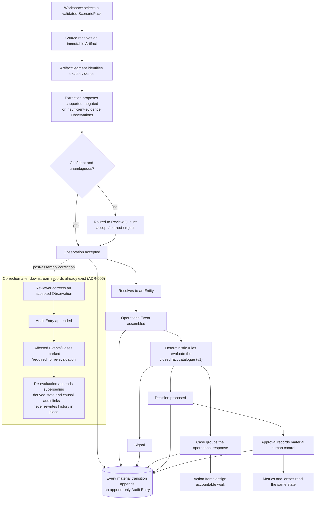

# Architecture

## Status

Contracts are frozen at **v1.5** (additive since the Wave 0 freeze — see
"Contracts evolution" below). Every package and mechanism described in this
document is merged and exercised by the test suite named alongside it; this
is not a forward-looking design document. Current project state (which waves
are complete, what remains) lives in `SESSION.md`; this document explains how
the merged pieces fit together and stays stable across that churn.

## Architectural style

OIW is a TypeScript modular monolith (ADR-001). The public demonstration is
one deployable Next.js web application (`apps/web`, `@oiw/web`) plus a set of
inward-dependency packages under `packages/` around contracts, domain policy,
application orchestration, persistence, intelligence, ingestion, rules,
audit, evaluation and presentation. There is no queue, no second server
framework and no external model provider on the critical path.

The repository is a pnpm workspace using pnpm's topological recursive
commands (`pnpm --recursive`). Turborepo remains intentionally deferred — the
build graph is still small enough that a task runner would add orchestration
overhead without a measured need.

## Package boundaries

| Package | Responsibility | May depend on |
|---|---|---|
| `@oiw/contracts` | Zod runtime schemas and inferred transport/domain types | Zod only |
| `@oiw/domain` | Pure domain policy and invariants | contracts |
| `@oiw/application` | Use-case orchestration, ports, rule-action executors, metric evaluation | contracts, domain |
| `@oiw/persistence` | Drizzle/PostgreSQL repository adapters and transaction implementation | contracts, domain, application ports |
| `@oiw/intelligence` | Structured provider interface; the deterministic fixture provider | contracts, application ports |
| `@oiw/ingestion` | Source adapter implementations (text, CSV, JSON, PDF text-layer) | contracts, application ports |
| `@oiw/rules` | Closed-catalogue rule condition evaluation | contracts, domain |
| `@oiw/scenario-sdk` | Pack loading, authoring and validation support (`buildPackRegistry`) | contracts |
| `@oiw/audit` | Append-only audit policy and implementation | contracts, application ports |
| `@oiw/ui` | Shared pack-configured presentation primitives | contracts |
| `@oiw/evals` | Evaluation runner and measures (`pnpm eval`) | contracts, application ports |
| `@oiw/test-support` | Synthetic factories and test-only adapters | any package under test |
| `apps/web` (`@oiw/web`) | Next.js application shell, routes, server actions | every package above |

Dependencies point inward toward contracts and domain policy. Core packages
do not import files from `scenario-packs/`; pack configuration enters only
through the Scenario Pack registry and validated contracts. Persistence and
providers do not call back into user-interface code.
`pnpm architecture:check` (`scripts/architecture-check.ts`) enforces this at
merge time — it scans core packages for prohibited industry terms and pack-id
literals, confirms the tree still compiles with any one pack directory
removed, and scans for committed-credential patterns (§"Architectural
enforcement" below).

## System flow

```mermaid
flowchart LR
    Source["Source adapter\n(@oiw/ingestion)"] --> Artifact["Immutable Artifact\n+ ArtifactSegments"]
    Artifact --> Provider["IntelligenceProvider\nstructured extraction\n(@oiw/intelligence)"]
    Provider --> Validate["Zod schema validation\n+ confidence/evidence policy\n(@oiw/contracts, @oiw/application)"]
    Validate -->|"confident, unambiguous"| Accepted["Accepted Observation"]
    Validate -->|"ambiguous, low-confidence,\nnegated or insufficient"| Review["Human review\n(Review Queue)"]
    Review --> Accepted
    Accepted --> EntityRes["Entity resolution\n(exact / alias / ambiguous-to-review)"]
    EntityRes --> Event["OperationalEvent assembly\n(@oiw/application, per EventDefinition)"]
    Event --> Rules["Closed-catalogue deterministic rules\n(@oiw/rules)"]
    Rules --> Signal["Signal"]
    Rules --> Case["Case + Action Items"]
    Rules --> Decision["Proposed Decision"]
    Decision --> Approval["Recorded human Approval"]
    Signal --> Metrics["Metrics, lenses, dashboards\n(@oiw/application MetricEvaluationService)"]
    Case --> Metrics
    Approval --> Metrics
    Accepted --> Audit[("Append-only Audit Entry\n@oiw/audit")]
    Event --> Audit
    Rules --> Audit
    Decision --> Audit
    Approval --> Audit
```

Mermaid source: [`docs/diagrams/system-flow.mmd`](diagrams/system-flow.mmd).

Scenario Packs provide labels, entity/observation/event/case schemas,
workflow definitions, rule definitions, metric parameters, dashboard
definitions, fixtures, evaluations and (optionally) guided-tour steps. They
never provide executable core code or arbitrary dashboard queries (ADR-002).

## Lifecycle and corrections

Mermaid source: [`docs/diagrams/lifecycle.mmd`](diagrams/lifecycle.mmd). See
`docs/DOMAIN_MODEL.md` for the object-level definitions this diagram walks
and ADR-006 for the correction-semantics decision it encodes. Verified by
`packages/persistence/src/postgres-repositories.test.ts`'s
`appends correction history and flags downstream state for re-evaluation`.

## Contracts evolution

`packages/contracts/` is the single source of runtime (Zod) and compile-time
(inferred TypeScript) truth. Every addition below is additive — no field or
schema has been removed since the Wave 0 freeze.

| Version | Adds | ADR | Notes |
|---|---|---|---|
| v1.0 | Canonical domain objects (Workspace, ScenarioPack, Source, Artifact, ArtifactSegment, Entity, Observation, OperationalEvent, Signal, Case, ActionItem, Decision, Approval, MetricDefinition, AuditEntry) per PRD §9 and `docs/DOMAIN_MODEL.md` | ADR-001–007 | Wave 0 contract freeze |
| v1.1 | Negated Observations, `alternativeCandidates` (per-candidate confidence), `conflicting` review status | ADR-008 | Narrative fixture authoring exposed states v1.0 couldn't represent without losing meaning |
| v1.2 | `ObservationSchemaDefinitionSchema` — pack observation schemas become a validated, queryable-by-key catalogue instead of opaque JSON | ADR-009 | Constrained JSON-Schema subset (string/number/boolean/object), no general JSON Schema engine |
| v1.3 | `EventDefinitionSchema` (required/optional Observations, `occurredAt`, `primaryEntity` mapping), `SeedEntityCatalogueSchema` | ADR-010 | Unlocked neutral Event assembly and Entity resolution against a real workspace catalogue |
| v1.4 | `CaseDefinitionSchema` (workflow reference, defaults, closure requirements, triggering rules) | ADR-011 | Replaced OIW-501's `rule-action-pending` placeholder Audit Entries with real Case/Action/Decision execution — see "The rule-action executor seam" below |
| v1.5 | `MetricDefinitionV15Schema` — five closed aggregation kinds (`count`, `count-where`, `count-by-field`, `trend-over-time`, `sla-derived`) over six canonical record types | ADR-012 | No SQL, expression string or pack-provided field path is representable |

Contract changes after this freeze go through a dedicated contract-change
task (`AGENTS.md` "Task Boundaries") — no implementation task edits
`packages/contracts/` incidentally.

## The rule-action executor seam

Rule evaluation (`@oiw/rules`, the closed fact catalogue — see "Rules and
facts" below) is decoupled from executing a fired rule's actions. A fired
`RuleAction` (`create-signal` / `create-case` / `create-action` /
`propose-decision` / `flag-review`) is executed through the
`RuleActionExecutor` port defined in
`packages/application/src/rule-execution.ts`. The concrete executor,
`OperationalOutcomeCoordinator`
(`packages/application/src/operational-outcome-executors.ts`), turns
`create-case`/`create-action`/`propose-decision` into real, persisted
Case/ActionItem/Decision writes via `CaseLifecycleService`,
`ActionItemService` and `DecisionService`. This is the seam ADR-011
introduced: OIW-501 originally executed these actions as pending
`rule-action-pending` Audit Entries (no Case/Decision engine existed yet);
OIW-506 wired the real executor in behind the same port, so
`ArtifactAdvancementService`'s caller-visible contract never changed. There is
one executor, not a per-pack or per-outcome branch.

## Contract validation boundaries

All data crossing a package, provider, storage or pack boundary is validated
with schemas from `@oiw/contracts`. TypeScript types are inferred from the
same schemas so runtime and compile-time contracts cannot drift
independently.

Artifact content and provider output are untrusted data. Intelligence
providers return structured objects only; application services decide
whether validated objects may be persisted or used. Providers cannot write
storage, execute rules, transition workflows, approve Decisions or call
external operational systems (verified in
`docs/SECURITY.md` §3.7 "Approval bypass").

## Deterministic fixture intelligence (amendment A1)

Each fixture Artifact ships a companion expected-extraction JSON file
conforming to `ExtractionResultSchema`, keyed by the Artifact's lowercase
SHA-256 checksum. `FixtureIntelligenceProvider`
(`packages/intelligence/`) performs an exact lookup by that checksum and
throws on a miss — it never synthesises or guesses a result. Fixture
Artifacts, evidence coordinates, expected extractions and gold evaluation
results are authored and versioned together
(`docs/PACK_AUTHORING.md` §4, the "checksum workflow").

This is the default and only P0 provider; the common `IntelligenceProvider`
interface also defines classification and summarisation, and a live/optional
provider (`OptionalLLMIntelligenceProvider`, PRD FR-021) can satisfy the same
interface with no caller-side branching, but no live provider is required or
enabled for the public demonstration. `pnpm eval` runs the full pack
lifecycle against the fixture provider for all three registered packs and, on
the current tree, scores 1.000 on every dimension in
`docs/EVALUATION.md` §4–8 (field precision/recall, classification accuracy,
evidence-span correctness, entity-resolution accuracy, abstention
precision/recall, rule-execution correctness, approval-policy correctness,
duplicate-event prevention, case-state correctness) — re-run it yourself with
`pnpm eval` before trusting that number on a different branch.

## Rules and facts (closed fact catalogue v1, amendment A2)

`@oiw/rules` evaluates `RuleDefinitionSchema` conditions. A condition may
reference only:

- an allow-listed Operational Event field (`eventType`, `occurredAt`,
  `recordedAt`, `entityIds`, or a named `attributes` key);
- an Observation selected by `schemaKey`, reading `value`,
  `normalisedValue`, `confidence`, `reviewStatus` or `evidenceStatus`;
- a core-computed aggregate: related-event count, open-case count,
  open-action count or pending-decision count, optionally constrained by
  the schema's declared parameters.

Unknown kinds, event fields, Observation fields and aggregate names fail
schema validation before a rule can execute. Packs cannot inject executable
predicates; rule actions come from the small core catalogue described above
and refer to pack-owned definitions by ID. Verified by
`packages/rules/src/engine.test.ts` and
`packages/scenario-sdk/src/rules.test.ts`.

## Workflow and corrections

Workflow definitions declare states, transitions, optional rule conditions,
approval policy references and closure requirements; `WorkflowDefinitionSchema`
itself rejects a transition whose `from`/`to` references an undeclared state.
Application services enforce transition and closure policy atomically
(`CaseLifecycleService`).

A reviewed correction made before Event assembly is simply the accepted input
to assembly. A correction after downstream records exist appends an Audit
Entry and marks affected Events and Cases `required` for re-evaluation. It
never rewrites or deletes historical downstream records; re-evaluation
appends new state and records its causal links (ADR-006, diagrammed above).

## Persistence and guest isolation (ADR-007, amendment A4)

P0 uses portable PostgreSQL through Drizzle. Hosted Supabase supplies
Postgres; Supabase-specific authentication, storage and row-level security
are not on the P0 critical path.

In public-demo mode, the server issues a signed, `httpOnly`, `Secure`,
`SameSite=Lax` session cookie containing an opaque session reference bound to
a workspace ID. Every server handler obtains workspace scope from the
verified session, never from a client-supplied workspace selector, and every
repository query includes that scope — enforced at the persistence layer, not
only the application layer
(`packages/persistence/src/postgres-repositories.test.ts`'s
`requires workspace scope for every read and write`). Guest workspaces expire
by a 24-hour absolute TTL and are deleted by the scheduled `pnpm demo:expire`
cleanup path. Rate limits combine the session reference and a
privacy-conscious IP-derived key (dual session/IP token buckets). Full threat
analysis, including the accepted process-local rate-limit-store risk, is
`docs/SECURITY.md` §2–§3.

## Dashboards and metrics (amendment A5)

P0 dashboard configuration selects from eight fixed widget kinds: stat card,
severity breakdown, list card, trend line, SLA table, pending approvals,
activity feed and text/impact (`docs/UX_SPEC.md` §6). Metric definitions
parameterise the closed v1.5 aggregation vocabulary above; packs supply
labels and parameters, never SQL, arbitrary expressions or executable
rendering code. Metric classification (`observed`, `calculated`,
`estimated`, `hypothetical`) is mandatory so the UI can distinguish evidence
from impact hypotheses (`docs/UX_SPEC.md` §7).

`apps/web/src/lib/server/metrics.ts` is a thin presentation adapter, not a
second metrics engine: it calls the real `MetricEvaluationService`
(`@oiw/application`) for every number and separately loads the same
workspace-scoped records to build presentation-only extras the service has
no concept of (sample titles, hrefs, SLA-table rows, activity-feed text).
Promoting those extras into the service itself is tracked as open follow-up
in `SESSION.md`, not a gap in the aggregation logic.

## Governance guarantees and their tests

| Guarantee | Decision | Verifying tests |
|---|---|---|
| Providers cannot write, approve or transition state | ADR-005, PRD §22.2 | `packages/application/test/artifact-advancement.integration.test.ts` ("records approve and reject outcomes and rejects adversarial approval bypasses"), `tests/security/decision-server-action.test.ts` |
| High-risk Decisions require a recorded human Approval | ADR-005 | `packages/persistence/src/postgres-repositories.test.ts` ("requires a matching human Approval before a Decision can become approved"), `tests/security/approval-concurrency.test.ts` |
| Corrections append and re-evaluate, never rewrite history | ADR-006 | `packages/persistence/src/postgres-repositories.test.ts` ("appends correction history and flags downstream state for re-evaluation") |
| Every workspace query is scoped server-side, never client-supplied | ADR-007 | `packages/persistence/src/postgres-repositories.test.ts` ("requires workspace scope for every read and write"), `apps/web/e2e/security.spec.ts` |
| Audit Entries are append-only | PRD §16.4 | `packages/persistence/src/postgres-repositories.test.ts` ("enforces append-only Audit Entries at the database boundary") |
| Untrusted Artifact content never becomes instruction | PRD §22.1 | `tests/security/injection/product-injection-matrix.test.ts`, `tests/security/injection/rule-fact-neutrality.test.ts`, `apps/web/e2e/injection.spec.ts` |
| No pack ID or industry term in core conditionals | PRD §10.1, ADR-002 | `pnpm architecture:check`, `packages/application/test/common-lifecycle.integration.test.ts` (same lifecycle across all three packs) |

`docs/SECURITY.md` is the authoritative, fully dispositioned threat model;
the table above is a pointer into it, not a duplicate.

## Architectural enforcement

`pnpm architecture:check` (`scripts/architecture-check.ts`) scans core
TypeScript sources for prohibited industry terms and committed-credential
patterns, and rejects direct Scenario Pack imports from core packages. CI
(`.github/workflows/ci.yml`) runs lint, type-check, unit/integration tests,
build, `pnpm eval`, `pnpm architecture:check` and the full Playwright suite
against a fresh, migrated Postgres service container on every pull request —
see `docs/EVALUATION.md` for the full testing pyramid and `docs/SECURITY.md`
§4 for the CI database strategy.
