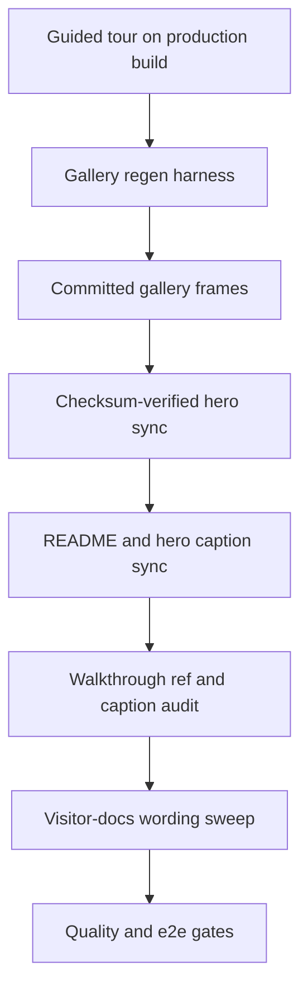

## Goal Capsule

- **Objective:** A visitor reading the README or any linked public doc sees the app as it actually looks today, with every screenshot and caption verifiable against a fresh local run.
- **Means:** Regenerate the gallery from the real guided-tour journey and audit visitor docs for stale wording (KTD1).
- **Authority:** docs/PRD.md and docs/PLAN_AMENDMENTS.md are authoritative; deviations need an ADR or explicit PR note. Frozen contracts in packages/contracts/ and migration history before the latest entry are untouched.
- **Stop conditions:** Stop and report as blocked if the regen harness cannot produce all seven frames from a clean production build, or if a caption claim cannot be verified against the fresh render.
- **Execution profile:** Docs-and-images change executed as code: branch, commits, full quality gates, PR. No app UI or behavior change.
- **Who finishes and ships:** The implementing agent runs regen, edits docs, runs gates, and opens the PR.

---

## Product Contract

### Summary

This plan regenerates the README screenshot gallery from the redesigned UI via the real tour journey, syncs the landing hero copy, and corrects stale wording across the visitor-facing docs so captions, counts, and screen names match what a fresh run shows.

### Problem Frame

The OIW-907 funnel polish redesigned the visual identity, landing page, scenario selector, adapt form, workspace shell, and dashboard widgets, and regenerated all seven gallery frames from the new UI. Since then the README gallery still references six of seven frames, the landing hero copy and several walkthrough captions assert specific widget names, values, and entry verbs, and the committed gallery copies have drifted from the served hero copies. A visitor comparing the README to a live local run sees mismatches they cannot resolve, which erodes trust in the evaluation, approval, and audit claims the docs make. The screenshots themselves are recent; the wiring, captions, and surrounding prose are what went stale.

### Requirements

**Gallery truth**

- R1. All seven gallery frames are produced from the real guided-tour journey against a production build, not from manual captures or a dev server.
- R2. The served hero copies are byte-identical to the committed gallery frames, verified by checksum, except for a transform documented in the PR.
- R3. The README gallery references every frame a first-time visitor needs, including the currently orphaned scenario-selector frame, with no dead image path.

**Caption and copy accuracy**

- R4. Every README alt text and caption describes only elements visible in its fresh frame, including confidence values, widget names, and audit entry verbs.
- R5. The landing hero image alt matches the regenerated leadership frame it displays.
- R6. Public counts and commands in the README are literally true on the planning tree: test totals, spec counts, pack names, quick-start commands, and CTA strings that tests assert are never edited to fit prose.

**Visitor-docs consistency**

- R7. Each walkthrough image reference resolves to a file the e2e suite actually writes, and each caption matches the screen the file shows.
- R8. The known wrong-file suspicion in the technical walkthrough rule-trace caption is resolved by viewing the PNGs, not by caption edit alone.
- R9. Pack intro deviation notes no longer claim tours do not exist, or the plan records why the claim stays with evidence.
- R10. Landing-spec drift from the OIW-907 expansion is recorded as an explicit deviation with a PR note rather than silently rewritten.

### Success Criteria

- A reviewer can run the documented regen command on a clean tree and reproduce the committed frames without manual retouching.
- A first-time reader can follow the README gallery, landing hero, and one walkthrough end to end without encountering a missing image, a renamed screen, or a count that disagrees with the repo.
- Both quality and e2e CI jobs pass on the docs PR with no app-behavior change.

### Scope Boundaries

- In scope: gallery regen and sync, README gallery and hero copy, walkthrough refs and captions, visitor-docs wording audit for the redesigned surfaces.
- Out of scope: any change to app rendering, components, tokens, tour behavior, contracts, migrations, pack fixtures, hosted deployment, email or webhook sinks, dark mode.
- Test-asserted strings stay verbatim; caption work never edits them.

#### Deferred to Follow-Up Work

- New gallery frames for the expanded marketing funnel beyond the scenario selector (landing pipeline grid, adapt form states, branded 404) beyond wiring the existing orphan.
- A CI assertion enforcing gallery-to-hero byte identity on every PR.
- A dedicated headless screenshot replay command replacing the temporary-spec pattern.
- UX spec and landing wireframe updates beyond the deviation note recorded here.

### Sources

- Regen harness behavior from apps/web/e2e/screenshot-regen.spec.ts and playwright config (production server on port 4300, gated by REGEN_SCREENSHOTS).
- Gallery and hero wiring from README.md gallery block and apps/web/src/app/page.tsx hero figure.
- Walkthrough refs from docs/walkthroughs/leadership.md, operations.md, technical.md against apps/web/e2e smoke and tour specs.
- OIW-907 evidence from docs/tasks/OIW-907.md and docs/agent-runs/OIW-907.md, plus OIW-906 and OIW-905 agent runs for regen pitfalls and caption drift.
- Quality gates from package.json scripts, .github/workflows/ci.yml, SESSION.md milestones, and scripts/architecture-check.ts neutrality scan.

---

## Planning Contract

### Key Technical Decisions

- KTD1. Regen runs the deterministic tour harness against a production build. Manual captures and dev-server renders are rejected because only the harness path is reproducible and CI-enforced.
- KTD2. The committed gallery is canonical and the served hero copies are derived by byte-identical copy. Checksum comparison after copy is the acceptance signal; any intentional transform is documented instead of silently diverging.
- KTD3. Gallery scope refreshes the existing seven frames in place and wires the orphaned scenario selector into the README. New marketing-surface frames are deferred so this change stays a truthfulness fix, not a gallery redesign.
- KTD4. Captions are rewritten from the fresh renders. Carried-over claims about confidence values, widget names, and audit verbs are treated as unverified until seen in the new pixels.
- KTD5. Walkthrough images refresh through the full e2e run that owns them, not through the gallery regen harness. The two systems use different framings and neither run refreshes the other.
- KTD6. Spec authority stays with the UX spec, demo script, and tour contracts. Landing expansion beyond the spec minimum ships as a recorded deviation with a PR note, and test-asserted copy is never edited for prose convenience.

### High-Level Technical Design

The work flows in one direction with a verification gate at each handoff.

Each stage is independently checkable: frames exist and show the tour without overlay, checksums match, captions name only visible elements, refs resolve to files the suite writes, and gates pass with no behavior change.

---

## Implementation Units

### U1. Regenerate gallery frames and sync hero copies

**Goal:** Produce all seven gallery frames from the real tour and make the served copies identical.

**Requirements:** R1, R2.

**Dependencies:** None.

**Files:**

- docs/screenshots/leadership-dashboard.png
- docs/screenshots/review-queue.png
- docs/screenshots/decision-card.png
- docs/screenshots/rule-trace.png
- docs/screenshots/case-detail.png
- docs/screenshots/audit-explorer.png
- docs/screenshots/scenario-selector.png
- apps/web/public/screenshots/leadership-dashboard.png
- apps/web/public/screenshots/review-queue.png
- apps/web/public/screenshots/decision-card.png
- apps/web/public/screenshots/rule-trace.png
- apps/web/public/screenshots/case-detail.png
- apps/web/public/screenshots/audit-explorer.png
- apps/web/public/screenshots/scenario-selector.png

**Approach:**

1. Run the gallery regen harness once against a clean production build with a migrated local database, single worker, foreground execution.
2. Confirm seven frames rewritten with current timestamps and the tour overlay dismissed in each.
3. Copy the gallery frames over the served hero copies and compare checksums.
4. Spot-view each frame for overlay residue, blank renders, and mid-mutation stalls before accepting.

**Patterns to follow:** Assert-then-shoot with tour exit before capture from apps/web/e2e/screenshot-regen.spec.ts; lens-redirect wait discipline from apps/web/e2e/smoke.spec.ts; OIW-907 regen-then-sync sequence from docs/agent-runs/OIW-907.md.

**Execution note:** This is packaging and environment work with a nondeterministic render surface; prefer a clean build plus production-server smoke verification over unit coverage, and retry once on locator or timing flake before diagnosing as product failure.

**Test scenarios:**

- Regen run completes both specs and rewrites seven PNGs with no skipped-by-gate accident.
- Each frame opens and shows its expected post-tour state with no tour panel visible.
- Checksum comparison after sync reports identical bytes for all seven pairs or names the documented transform.
- A second routine e2e run without the regen flag leaves the committed gallery untouched.

**Verification:** Seven current frames on disk, matching checksums or a documented exception, and a visual pass note in the PR body.

### U2. Sync README gallery and hero copy

**Goal:** Make the README gallery and landing hero say only what the fresh frames show.

**Requirements:** R3, R4, R5, R6. Governs caption truth per KTD4.

**Dependencies:** U1.

**Files:**

- README.md
- apps/web/src/app/page.tsx

**Approach:**

1. Wire the orphaned scenario-selector frame into the gallery where a first-time visitor orients, keeping the existing gallery order otherwise stable.
2. Rewrite each alt and caption from the fresh pixels, verifying confidence values, widget names, and audit verbs.
3. Sync the hero image alt with the regenerated leadership frame without changing hero layout or behavior.
4. Verify every count, command, and CTA string literally, leaving test-asserted strings verbatim.

**Patterns to follow:** Existing gallery shape of hero plus review queue plus three-column decision trio plus audit; hero figure with browser chrome and single leadership image; OIW-905 lesson that test counts and spec counts drift faster than prose.

**Test scenarios:**

- Every gallery image path in the README resolves to a committed frame.
- Each alt names an element confirmed visible in its frame on the planning tree.
- The hero alt matches the current leadership frame, not the pre-redesign wording.
- Quick-start commands run verbatim and stated counts match the repo's scripts and suite size.
- No diff touches a test-asserted string covered by the web suite or security specs.

**Verification:** README renders with no broken images, alts match pixels, and the docs PR shows no app-behavior diff beyond the hero alt.

### U3. Audit walkthrough image refs and captions

**Goal:** Make each walkthrough image load the screen its caption promises.

**Requirements:** R7, R8. Governs ref truth per KTD5.

**Dependencies:** U1.

**Files:**

- docs/walkthroughs/leadership.md
- docs/walkthroughs/operations.md
- docs/walkthroughs/technical.md

**Approach:**

1. Run the full e2e suite once so the walkthrough source frames refresh from the redesigned UI.
2. Resolve every walkthrough image path against files the suite writes, including desktop and tablet variants.
3. View the rule-trace candidate files and resolve the technical walkthrough wrong-file suspicion to the correct frame.
4. Correct captions to the rendered screens, keeping spec screen names where the spec is normative and matching on-page headings otherwise.

**Patterns to follow:** Full-page desktop plus tablet capture discipline from the smoke and tour specs; OIW-905 warning that fixture-driven walkthrough shots go stale before prose.

**Test scenarios:**

- Every walkthrough image reference resolves to a file present after a fresh e2e run.
- The technical rule-trace caption points at the frame that actually shows the condition tree and evaluated clauses.
- Each caption names the pack, screen, and state visible in its frame with no pre-redesign label surviving.
- Tablet variants referenced anywhere also resolve; unreferenced variants stay unreferenced rather than half-wired.

**Verification:** Walkthrough docs render with no missing images and captions verified against the refreshed frames.

### U4. Sweep visitor docs and run gates

**Goal:** Remove stale UI wording from the docs a new visitor actually reads, then prove nothing behavioral changed.

**Requirements:** R9, R10. Governs spec authority per KTD6.

**Dependencies:** U2, U3.

**Files:**

- docs/DEMO_SCRIPT.md
- docs/ARCHITECTURE.md
- docs/UX_SPEC.md
- docs/ux/00-landing.md
- scenario-packs/asset-reliability/README.md
- scenario-packs/process-exceptions/README.md
- scenario-packs/document-assurance/README.md
- scenario-packs/_template/README.md

**Approach:**

1. Correct pack intro deviation notes that deny tours exist, or record evidence for why a note stays, with pack ownership confirmed before editing pack paths.
2. Correct the stale architecture pointers for deployment targets and the rate-limit store without touching contracts or migration history.
3. Record the landing expansion beyond the spec minimum as an explicit deviation with a PR note rather than rewriting the spec.
4. Run the full gate set on the final tree and record results in the PR.
5. Re-verify every R6 count, command, and CTA string against the final tree after gates pass and record the verified commit SHA in the PR body.

**Patterns to follow:** Pack-neutrality scan in scripts/architecture-check.ts; OIW-907 deviation logging for landing sections beyond the spec minimum; SESSION.md debt notes for known e2e flake under parallel workers.

**Execution note:** Prefer gate and suite evidence over new unit tests; this unit changes prose and images only, so smoke and suite verification is the correct proof.

**Test scenarios:**

- Test expectation: none for new unit coverage -- prose and image change with no behavioral surface.
- Full lint, typecheck, unit and integration, pack validation, eval, build, and architecture check pass.
- Full Playwright suite passes on the docs tree with the gallery untouched by the routine run.
- Counts, commands, and CTA strings re-checked on the final tree match the merged prose at the recorded SHA.
- Pack READMEs either state the tour reality correctly or carry an evidence note explaining the exception.

**Verification:** Green quality and e2e jobs on the PR plus a sweep table in the PR body naming each doc touched and what was verified.

---

## Verification Contract

| Gate | Command | Applies |
|---|---|---|
| Lint | pnpm lint | All units |
| Types | pnpm typecheck | U2 hero alt change and any doc-code touch |
| Unit and integration | pnpm test | U4 final tree |
| Packs | pnpm validate:packs | U4 when pack READMEs touched |
| Eval | pnpm eval | U4 final tree |
| Build | pnpm build | U1 regen baseline and U4 final tree |
| Neutrality | pnpm architecture:check | U4 final tree |
| Gallery regen | REGEN_SCREENSHOTS=1 run of the gallery regen specs from apps/web | U1 |
| Full journeys | Full Playwright e2e run from apps/web | U3 walkthrough refresh and U4 final proof |

Regen runs against a clean production build with migrated Postgres, single worker, foreground execution. Routine e2e runs must not rewrite the committed gallery.

---

## Definition of Done

**Global:**

- All seven gallery frames are fresh from the real tour journey with no overlay residue.
- Served hero copies match the gallery by checksum or a documented transform.
- README, hero, walkthroughs, and swept visitor docs describe only what the fresh tree shows.
- Quality and e2e jobs exist and pass; no app behavior, contract, or migration change ships.
- PR body records regen evidence, checksum results, the wrong-file resolution, pack-ownership confirmation, and the spec-deviation note.

**Per unit:**

- U1 done when seven current frames exist, checksums match or document the exception, and a visual pass is recorded.
- U2 done when every gallery path resolves, every alt matches its pixels, and test-asserted strings are untouched.
- U3 done when every walkthrough ref resolves after a fresh e2e run and the rule-trace suspicion is resolved by viewing.
- U4 done when the sweep table is complete, pack edits carry ownership confirmation, and all gates pass.

---

## Appendix

- Known drift at planning time: five of seven served hero copies differed by bytes from the gallery; only the review queue and scenario selector matched. The plan treats the gallery as canonical and re-syncs.
- Known framing split: gallery regen uses viewport-only captures while walkthrough sources use full-page desktop plus tablet captures, so one run cannot refresh both sets.
- Known flake surface: parallel-worker accessibility timeouts, fixed capture delays instead of network idle, and the pre-existing in-flight render stall on the production server. Single-worker foreground regen with one retry is the mitigation.
- Manual captures under the gitignored local screenshot directory are evidence only and never committed.
- No Compound Packs resolved and no solutions library exists, so pack citations are absent and prior agent runs serve as the institutional record.
