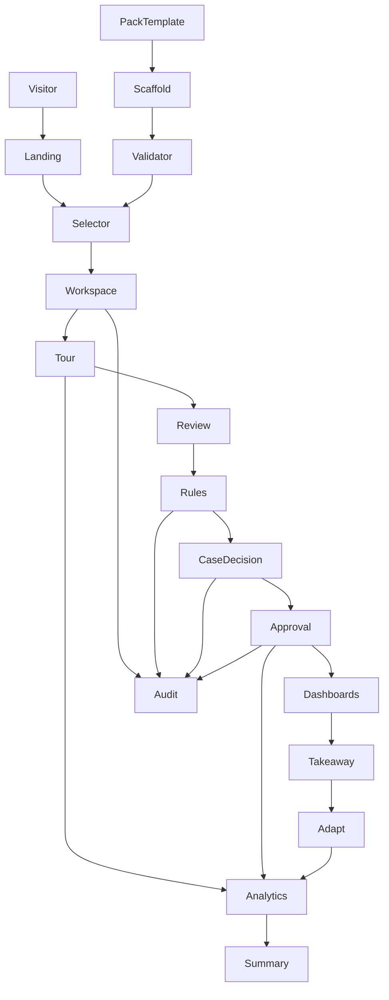
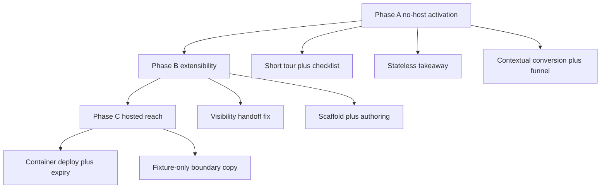
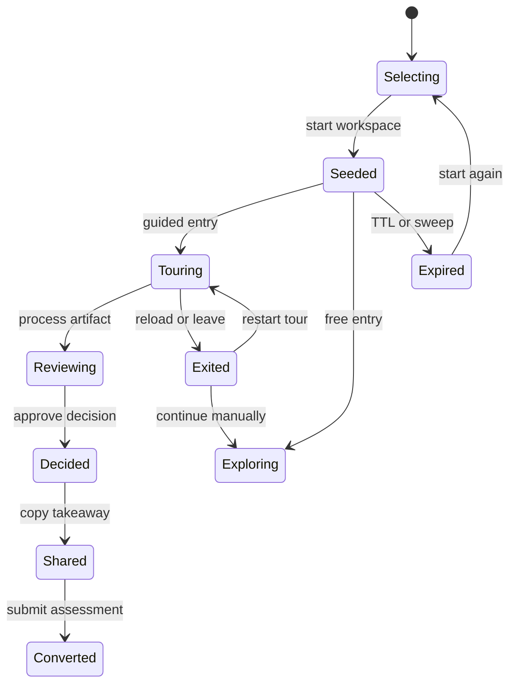

# Value and Traction Upgrade - Plan

## Goal Capsule

- **Objective:** A non-technical visitor grasps what the workbench does and completes one evidence-backed journey without installing anything, a technical evaluator verifies trust controls and extends a scenario pack without forking core, and each completed journey measurably raises the chance of an assessment conversation.
- **Means:** Ship no-host activation and shareability first over the existing deterministic demo, then unblock hosted try-it-now and pack scaffolding behind the same isolation and neutrality guards (KTD1, KTD6).
- **Authority:** `docs/PRD.md` and `docs/PLAN_AMENDMENTS.md` govern product scope, `docs/decisions/` ADRs govern neutrality and governance, this plan governs implementation mechanism within those constraints.
- **Stop conditions:** Stop and return as blocked if hosted deployment requires relaxing guest isolation or approval enforcement, if a takeaway requires persistent share tokens beyond the approved stateless shape, or if pack work requires new rule facts outside the v1.5 contract without a dedicated contract-change task.
- **Execution profile:** Code plan executed as phased implementation units with smoke-first proof on demo paths and contract and eval gates on trust paths.
- **Finishes and ships:** Implementation agent or human lands the units in dependency order and the reviewer confirms Verification Contract and Definition of Done.

---

## Product Contract

### Summary

This plan targets a value and traction upgrade that keeps the core neutral and the demo deterministic while making the product tryable by business buyers without a local install, extensible by technical evaluators without core changes, and shareable and measurable for outreach.

### Problem Frame

The repository is public with all P0 scope merged and continuously enforced in CI, yet every command still runs against a local clone.
A non-technical buyer must clone, install, run Postgres, migrate, and start the app before seeing the ten-step journey from raw artifact to approved decision.
There is no hosted URL to forward, no takeaway to share after a tour, and only one fixed call to action.
A technical evaluator can inspect evidence and audit trails but cannot preview a new pack without hand-editing web-owned files, and the authoring loop is filesystem plus CLI with no in-app preview.
Engagement signals exist as aggregate counts only, so the owner cannot tell which pack or step leaks.
The risk is not missing capability but missing activation: the platform proves neutrality and governance to those who already run it, without converting passing interest into pilot conversations.

### Requirements

**Non-technical onboarding**

- R1. A first-time visitor reaches a plain-language value story and starts the guided journey without cloning or configuring a database.
- R2. The guided journey reaches one activation moment within a short tour plus progressive follow-ups rather than requiring all ten steps up front.
- R3. A visitor who reloads, navigates away, hits a rate limit, or lets a session expire receives a clear resume or restart path instead of a silent exit.
- R4. A visitor leaves with a copyable demo summary that names the scenario, completed steps, decision outcome, and synthetic-data notice.
- R5. Every projected figure on marketing or takeaway surfaces carries its provenance badge and qualifier and never appears as a measured outcome.

**Technical extensibility**

- R6. A technical evaluator inspects raw artifact, extraction, evidence span, confidence, rule trace, and audit chain for any demo decision.
- R7. A pack author scaffolds a new scenario pack from the validated template and reaches a precise validation result in a short local loop.
- R8. A new pack becomes tryable through the same selector contract without pack-specific code in core.
- R9. The active-pack explanation shows the closed catalogues that prove neutrality in addition to the pack manifest summary.

**Traction loop**

- R10. Contextual calls to action appear after meaningful progress in addition to the persistent shell entry, all preserving the scenario context.
- R11. Tour completion and decision outcome flow into the assessment conversation through allowlisted context only, never free-text or personal data.
- R12. The owner reads per-scenario funnel aggregates from existing events without new tracking vendors or per-visitor journey views.
- R13. Assessment submissions continue to land in the first-party store with the existing validation and rate limits unchanged.

**Guardrails**

- R14. Core packages never branch on pack identity or embed industry language, and every pack change passes validation and neutrality checks.
- R15. The public demo stays deterministic and synthetic by default, with unknown inputs routed to review rather than guessed.
- R16. Guest isolation, workspace scoping, opaque redirects, and dual rate limiting hold on every new surface including hosted deployment.

### Key Decisions

- **Ship no-host wins before hosted try-it-now.** Phased delivery unblocks activation without waiting for hosting operations. Governs R1, R2, R3, R4, R10, R12.
- **Keep the takeaway stateless.** A copyable summary plus existing export downloads avoids new share-token subjects, TTL design, and audit changes. Governs R4, R16.
- **Keep hosted input fixture-only.** Own-data trials happen via local fixture authoring or the assessment conversation, preserving the synthetic-only hardening. Governs R15, R16.
- **Keep analytics aggregate-only.** Funnel insight comes from the summary script over closed context keys, with no new event names and no per-session views. Governs R11, R12.
- **Fix the pack-visibility handoff in two steps.** Short-term curation checklist plus enumeration fix, medium-term registry-driven selector behind the same card contract. Governs R7, R8.

### Actors

- A1. First-time non-technical visitor arriving from landing, selector, or a forwarded summary.
- A2. Operational manager walking review, case, and decision approval.
- A3. Technical evaluator inspecting traces, exports, and deployment posture.
- A4. Contributor or pack author scaffolding and validating a new scenario.
- A5. Owner or consultant reading funnel aggregates and assessment submissions.

### Key Flows

- F1. First-time activation: landing to selector to guided start to process to review to rule trace to case to decision approval to dashboard to audit to takeaway to assessment. Covered by R1, R2, R3, R4, R10, R11.
- F2. Operations walkthrough: inbox processing to review resolution to event assembly to signal and case creation to decision approval with comment. Covered by R2, R3.
- F3. Technical verification: artifact inspection to rule trace to audit to export to pack authoring to validation. Covered by R6, R7, R8, R9.
- F4. Returning comparison: second selector visit to second workspace to contrast pack without recovering the first workspace. Covered by R1, R3.
- F5. Measurement: page and action events to aggregate summary to assessment submission count. Covered by R11, R12, R13.

### Success Criteria

- A new visitor reaches the activation moment faster than the current full ten-step path and completes at a higher rate.
- Tour exits, rate limits, and expiries produce an explained next step rather than abandonment.
- Completed tours convert to assessment opens and submissions at a rate the owner can read per scenario.
- Deterministic evaluation stays at its current scores and neutrality and security gates stay green throughout.
- A fourth pack can move from scaffold to selector without breaking the lifecycle suite.

### Scope Boundaries

- In scope is activation, shareability, contextual conversion, aggregate measurement, pack scaffolding and visibility, hosted deployment of the existing image, and the input-boundary copy that explains fixture-only limits.
- Deferred to follow-up work is a multi-workspace switcher, persistent share-link tokens with revocation, a visual pack builder UI, a live intelligence provider as default, third-party analytics vendors, email and webhook delivery implementations, and any client-pilot capability from the P2 backlog including production auth, SSO, ERP and CRM connectors, and write-back adapters.
- Outside this product identity are a complete ERP, a no-code application builder, a generic chatbot, an autonomous control system, a replacement for human approval, a native mobile app, a multi-tenant billing platform, a marketplace of hundreds of connectors, and any claim that illustrative figures are realised customer outcomes.

### Sources & Research

- Repo evidence: `apps/web/src/app/demo/page.tsx` and `apps/web/src/app/demo/[pack]/page.tsx` render from curated stub packs, `apps/web/src/lib/tour/steps.ts` holds ten steps per pack, `apps/web/src/components/tour/TourOverlay.tsx` holds session-only tour state, `packages/application/src/workspace-service.ts` and `packages/application/src/seed-service.ts` create deterministic guest workspaces, `apps/web/src/lib/server/workspace.ts` enforces opaque workspace guards, `apps/web/src/lib/server/rate-limit.ts` enforces dual buckets, `packages/application/src/exports.ts` exports cases and audit as downloads, `packages/application/src/product-analytics.ts` holds the closed event allowlist, `apps/web/src/app/adapt/` holds the qualified assessment form, `Dockerfile` and `docker-compose.yml` already build a standalone image with baked packs, `docs/DEPLOYMENT.md` still describes the prior host target while `SESSION.md` records the container plus managed Postgres direction.
- Architecture constraints: `docs/decisions/ADR-002-scenario-packs.md` for neutrality, `docs/decisions/ADR-004-deterministic-demo.md` for checksum-keyed fixture failure, `docs/decisions/ADR-003-provenance-model.md` and `docs/decisions/ADR-005-human-approvals.md` for evidence and approval enforcement, `docs/decisions/ADR-007-guest-session-isolation.md` for portable isolation and rate limits.
- External landscape shaped the phasing: disposable seeded front-ends and template-to-instance share patterns over full hosting first, short activation tours plus checklists over long linear tours, validated-config templates with allowlisted actions for pack growth, and buyer-math impact framing with ranges and visible assumptions over vendor ROI promises.

---

## Planning Contract

### Key Technical Decisions

- KTD1. Split the ten-step tour into a short activation tour plus progressive follow-ups with a persistent checklist, keeping tour state client-side. A shorter path to one approval raises completion without server tour state or protocol changes.
- KTD2. Implement the takeaway as a stateless client-rendered summary plus existing export downloads, with no new share-token table and no relaxation of workspace guards or attachment headers. Shareability arrives without new auth or audit subjects.
- KTD3. Extend contextual calls to action behind the existing session-local detail-visit signal and reuse the scenario-prefill pattern. Progressive disclosure arrives without tracking dependencies or permission changes.
- KTD4. Keep curated selector cards short-term with an explicit authoring checklist step, and move to registry-driven cards behind the same card contract medium-term alongside the lifecycle enumeration fix. The north-star proof survives without pack conditionals in core.
- KTD5. Build pack scaffolding as a validated-config emitter that copies the template, renames identifiers, computes checksums and evidence offsets, and fails closed on custom predicates or queries. Authoring speed arrives without widening the closed fact and widget catalogues.
- KTD6. Deploy the existing standalone image to the container target with managed Postgres, shared Postgres rate-limit store, scheduled shell expiry, and a rewritten deployment runbook before announcing any public URL. Zero-install reach arrives on the already-recorded host direction without edge or file-tracing serverless.
- KTD7. Keep the hosted demo fixture-only and frame real-input trials as local fixture variants plus the assessment conversation, with explicit do-not-submit-confidential copy. Evaluator curiosity is answered without input policy, retention, or injection-matrix expansion.
- KTD8. Extend only the read-only analytics summary with per-scenario funnel aggregates over existing closed context keys. Measurement arrives without new events, raw network identity, or per-session journey views.

### High-Level Technical Design

The work layers traction surfaces over the existing modular monolith without moving domain boundaries.
New entry, tour, takeaway, conversion, and measurement components read from the same workspace, pack registry, processing, and audit services through the same guards.
Hosting reuses the same image and expiry runner on a container target.

Phasing keeps no-host value shippable before hosting operations land.

Workspace and tour states stay explicit so unhappy paths are specified rather than silent.

Sketches above are authoritative structure alongside the prose and carry no implementation code.

### Sequencing

- Phase A lands first and is independently shippable without hosting: tour activation, takeaway, contextual conversion, and funnel aggregates.
- Phase B lands next: pack visibility handoff plus scaffold and authoring improvements.
- Phase C lands last: hosted deployment with expiry and runbook, plus the fixture-only boundary copy that depends on knowing the hosted URL.
- No phase relaxes isolation, approval enforcement, or contract freeze to unblock a later phase.

### System-Wide Impact

- Guest isolation and rate limiting extend to every new route and action, with the shared Postgres store required wherever more than one instance serves traffic.
- Workspace lifecycle gains clearer expiry and reload messaging but no new session model and no cross-workspace history.
- Contracts stay at v1.5: no new rule facts, actions, metric aggregations, or widget types arrive through pack data or builder output.
- Analytics stays first-party and aggregate-only with no third-party script and no widened event context.

### Risks & Dependencies

- Hosting cost and operations risk if expiry scheduling or pool sizing is skipped, mitigated by landing Phase A first and gating the public URL on the deployment smoke checks.
- Time-to-live constants are code rather than configuration, so any promise of longer sessions requires an app change with reset and expiry coverage.
- The selector curation and lifecycle enumeration coupling breaks a fourth pack until fixed together, so visibility work ships as one unit.
- In-flight render aborts on navigation remain a known platform behavior, so tour progression keeps idempotent processing and card-local failure states.
- Any projected figure risks false-ROI perception, mitigated by confining hypothetical numbers to badged impact surfaces with visible assumptions.

---

## Implementation Units

### U1. Short activation tour with checklist and explained unhappy paths

- **Goal:** Visitors reach one approval faster and recover cleanly from reload, limits, and expiry.
- **Requirements:** R1, R2, R3.
- **Dependencies:** None.
- **Files:** `apps/web/src/lib/tour/steps.ts`, `apps/web/src/components/tour/TourOverlay.tsx`, `apps/web/src/components/tour/` checklist and notice components, `apps/web/src/app/demo/[pack]/page.tsx`, `apps/web/src/app/w/[workspace]/inbox/actions.ts`, `apps/web/tests/tour-steps.test.ts`, `apps/web/tests/tour-overlay.test.tsx`, `apps/web/e2e/north-star.spec.ts`.
- **Approach:**
  1. Split the existing step lists into a short activation path ending at one approval plus progressive follow-ups and a persistent checklist, per KTD1.
  2. Add reload-exit, rate-limit, and expiry messaging on existing empty and error patterns without introducing server tour state.
  3. Keep idempotent fixture processing and redirect discipline on every tour navigation.
- **Execution note:** This is mostly interaction and packaging; prefer guided-tour smoke verification over unit coverage where behavior is visual.
- **Patterns to follow:** Existing data-tour spotlights, before-next fixture processing, tour-completed analytics, non-modal focus-managed panel.
- **Test scenarios:**
  - Happy path: starting the short tour from the pack start processes the pinned artifact, accepts the review item, and reaches an approved decision with dashboard and audit updates.
  - Edge case: reloading mid-tour exits the overlay with a restart or manual-continue notice and no lost workspace data.
  - Error path: hitting the processing rate limit on a tour advance shows a retry-after message and preserves the current step.
  - Integration scenario: completing the short tour emits the completion event and the checklist reflects the finished activation.
- **Verification:** The short tour is completable from a fresh workspace, unhappy paths explain the next step, and existing tour specs still pass.

### U2. Plain-language value story and stateless demo takeaway

- **Goal:** Non-technical visitors understand the outcome and leave with something forwardable.
- **Requirements:** R1, R4, R5.
- **Dependencies:** U1.
- **Files:** `apps/web/src/app/page.tsx`, `apps/web/src/app/demo/page.tsx`, `apps/web/src/app/w/[workspace]/overview/page.tsx`, takeaway summary component under `apps/web/src/components/`, `apps/web/src/components/widgets/` provenance usage, `apps/web/e2e/` tour and accessibility specs covering the new surfaces.
- **Approach:**
  1. Tighten landing and selector copy around lost-to-actioned information without adding vertical-specific claims, per R14.
  2. Add the stateless copyable summary with scenario, entry, completed steps, decision outcome with rule reference, and synthetic-data footer, per KTD2.
  3. Apply provenance badges and qualifier sentences to every projected figure, keeping hypothetical numbers out of stat and trend widgets.
- **Execution note:** This is mostly content and presentation; prefer rendered smoke verification across lenses and widths over unit coverage.
- **Patterns to follow:** Existing shell notice, dashboard grid, provenance badge confinement, assessment entry-point copy.
- **Test scenarios:**
  - Happy path: after one approval the takeaway shows the correct scenario, decision outcome, rule reference, and synthetic notice with a working copy action.
  - Edge case: with no decision yet the takeaway shows progress without implying an outcome.
  - Error path: copy failure leaves the visible summary intact with a retry affordance.
  - Integration scenario: takeaway content matches the persisted audit chain for the same workspace.
- **Verification:** The story reads without install instructions above the fold, the takeaway matches audit truth, and hypothetical figures are always badged.

### U3. Contextual conversion and aggregate funnel reporting

- **Goal:** More completed journeys reach the assessment conversation and the owner sees where they drop off.
- **Requirements:** R10, R11, R12, R13.
- **Dependencies:** U1, U2.
- **Files:** `apps/web/src/components/shell/TopBar.tsx`, overview and case-detail conversion entry points, `apps/web/src/app/adapt/page.tsx`, `apps/web/src/app/adapt/AdaptForm.tsx`, `apps/web/src/app/api/analytics/route.ts`, `packages/application/src/product-analytics.ts`, `scripts/analytics-summary.ts`, `apps/web/tests/server-workspace.test.ts`, analytics route tests.
- **Approach:**
  1. Add the specified engaged-visitor and closure-adjacent entries behind the session-local detail-visit signal, reusing the scenario-prefill pattern per KTD3.
  2. Pass only allowlisted context from completed journeys into the assessment entry, keeping server-side workspace authority.
  3. Extend the summary script with per-scenario funnel aggregates over existing closed keys without new events or identity widening.
- **Patterns to follow:** Existing persistent call to action, scenario query prefill, best-effort analytics that never fails the product mutation, aggregate-only summary output.
- **Test scenarios:**
  - Happy path: visiting a case detail then the overview reveals the contextual entry with the correct scenario prefill.
  - Edge case: direct assessment visits without workspace context still submit with form-entered scenario.
  - Error path: analytics endpoint rejection never blocks tour processing, review resolution, or decision approval.
  - Integration scenario: a full journey from tour completion through approval to assessment submission increments each funnel aggregate exactly once.
- **Verification:** Conversion entries appear at the right progress points, assessment validation and sink behavior are unchanged, and funnel output answers per-scenario drop-off without personal data.

### U4. Pack visibility handoff fix

- **Goal:** A validated pack can become tryable without breaking core or tests.
- **Requirements:** R7, R8, R14.
- **Dependencies:** None.
- **Files:** `apps/web/src/lib/stub/packs.ts`, `apps/web/src/app/demo/page.tsx`, `apps/web/src/app/demo/[pack]/page.tsx`, `packages/scenario-sdk/src/registry.ts`, `packages/application/test/common-lifecycle.integration.test.ts`, `scripts/validate-packs.ts`, `docs/PACK_AUTHORING.md`, `scenario-packs/_template/README.md`.
- **Approach:**
  1. Add the explicit selector-registration checklist step and validator guidance for the web-owned change, per KTD4.
  2. Make lifecycle enumeration robust to additional packs while keeping the template excluded from the public selector.
  3. Keep selector cards behind the same pack-supplied contract with no pack-identity branches in core.
- **Patterns to follow:** Existing registry sorting and skip rules, path-annotated validator errors, authoring-order documentation.
- **Test scenarios:**
  - Happy path: adding a fixture-valid fourth pack directory keeps validation green and appears through the documented registration step.
  - Edge case: the template directory remains excluded from both validation failures and public selector cards.
  - Error path: an invalid pack fails with a path-annotated message naming the selector-registration requirement when applicable.
  - Integration scenario: the common lifecycle suite runs across all registered real packs without pack-specific test code.
- **Verification:** Validation, lifecycle, and selector behavior agree on which packs are public, and neutrality checks still pass.

### U5. Pack scaffolding and neutrality proof surfaces

- **Goal:** Authors move from template to validated pack faster and evaluators see why the core is neutral.
- **Requirements:** R6, R7, R9.
- **Dependencies:** U4.
- **Files:** Scaffold CLI script under `scripts/`, `scenario-packs/_template/`, `docs/PACK_AUTHORING.md`, `apps/web/src/app/w/[workspace]/about-pack/page.tsx`, `packages/scenario-sdk/README.md`, `docs/walkthroughs/technical.md`, CLI and validator tests.
- **Approach:**
  1. Add the scaffolding command as a validated-config emitter with identifier renaming plus checksum and evidence-offset computation, per KTD5.
  2. Refresh authoring order, discriminator checklist, and troubleshooting around the gold-after-extraction discipline.
  3. Extend the active-pack explanation with read-only closed-catalogue references from existing contract sources.
- **Execution note:** This is mostly scaffolding and documentation; prefer end-to-end scaffold plus validation smoke verification over isolated unit coverage.
- **Patterns to follow:** Existing template metric coverage, checksum workflow, validator error vocabulary, generic pack-label resolution.
- **Test scenarios:**
  - Happy path: scaffolding from the template produces a directory that passes validation on first run.
  - Edge case: rerunning scaffolding into a non-empty directory fails with a non-destructive message.
  - Error path: scaffold output containing an unknown fact or widget fails validation rather than rendering.
  - Integration scenario: a scaffolded pack with smoke fixtures completes the common lifecycle path without core changes.
- **Verification:** A new author reaches validation green from scaffold plus docs alone, and the neutrality explanation cites live contract sources.

### U6. Hosted try-it-now deployment path

- **Goal:** Non-technical visitors try the guided journey from a public URL with the same isolation guarantees.
- **Requirements:** R1, R13, R16.
- **Dependencies:** U1, U3.
- **Files:** `Dockerfile`, `docker-compose.yml`, `.env.example`, `docs/DEPLOYMENT.md`, expiry scheduling workflow or scheduler configuration, `apps/web/src/lib/server/session.ts`, `apps/web/src/lib/server/rate-limit.ts`, deployment smoke checklist.
- **Approach:**
  1. Deploy the existing standalone image with baked packs to the container target with managed Postgres, per KTD6.
  2. Configure required secrets and proxy headers, switch the shared rate-limit store for multi-instance service, and schedule shell expiry on a trusted runner.
  3. Rewrite the deployment runbook sections for the chosen host and record the smoke results including tour, assessment, export, and analytics-summary delta.
- **Execution note:** This is mostly packaging and operations; prefer deployment smoke verification over unit coverage.
- **Patterns to follow:** Existing standalone output, baked pack directory mounting, opaque workspace guards, dual-bucket denial auditing, attachment headers on downloads.
- **Test scenarios:**
  - Happy path: a fresh public session creates an isolated workspace, completes the short tour, submits an assessment, and expires on schedule.
  - Edge case: two concurrent public workspaces do not share data and rate limits account correctly across instances.
  - Error path: an expired public workspace redirects to the selector with an explanatory restart message and no existence disclosure.
  - Integration scenario: expiry sweep removes only expired workspaces and preserves analytics aggregates and assessment submissions.
- **Verification:** The public URL passes every deployment smoke check, isolation and rate-limit suites pass against the hosted configuration, and no unauthenticated expiry or mutation endpoint exists.

### U7. Fixture-only boundary copy and launch readiness

- **Goal:** Evaluators understand input limits before trying, and outreach ships with honest reproducible proof.
- **Requirements:** R5, R15.
- **Dependencies:** U2, U5, U6.
- **Files:** `apps/web/src/app/demo/[pack]/page.tsx`, inbox-adjacent copy, `apps/web/src/app/adapt/page.tsx` privacy notice, `README.md`, `docs/walkthroughs/`, `docs/screenshots/` regeneration harness, `docs/agent-runs/` handoff record.
- **Approach:**
  1. Document the hosted fixture-only boundary with the local fixture-variant path and do-not-submit-confidential guidance, per KTD7.
  2. Regenerate tour screenshots from real guided runs and align landing, walkthrough, and selector copy with the shipped short tour.
  3. Capture hosting, boundary, builder, report, and funnel choices as a durable learning for future packs and pilots.
- **Execution note:** This is mostly content and release hygiene; prefer rendered and screenshot smoke verification over unit coverage.
- **Patterns to follow:** Existing synthetic-data notices, vendored-asset offline reproducibility, screenshot regeneration from production tour runs.
- **Test scenarios:**
  - Happy path: the pack start page states fixture-only limits and links the local authoring path and assessment conversation.
  - Edge case: pasted own-input attempts receive the abstain-to-review explanation rather than a guessed extraction.
  - Test expectation: none -- no behavioral code path beyond copy and generated assets; verification is rendered review plus screenshot diff.
- **Verification:** Copy states the boundary consistently across entry points, screenshots match the shipped tour, and no confidential-data prompt exists on the public path.

---

## Verification Contract

| Command | Proves |
|---|---|
| `pnpm lint` | Changed web, package, script, and test surfaces meet lint gates |
| `pnpm typecheck` | Workspace type surfaces including new tour, takeaway, conversion, scaffold, and summary changes compile |
| `pnpm test` | Unit, contract, integration, and security suites pass including lifecycle enumeration and analytics route coverage |
| `pnpm eval` | Deterministic extraction, rule, approval, and abstention behavior is unchanged across all packs |
| `pnpm build` | Standalone image inputs including new routes and baked packs still compile |
| `pnpm validate:packs` | Every pack including scaffold output remains schema and reference valid |
| `pnpm architecture:check` | No pack-identity branches, industry terms, or prohibited egress entered core |
| `pnpm analytics:summary` | Funnel aggregates read correctly from seeded and live events without personal data |
| `pnpm db:migrate` plus `pnpm demo:seed --pack <id>` | Seeded workspaces reproduce the short tour starting state deterministically |
| `(cd apps/web && pnpm test:e2e)` | North-star journey, per-pack tours, review and approval, exports, injection matrix, accessibility, and new conversion and takeaway specs pass |

Smoke-first proof applies to tour, takeaway, conversion, scaffold, and hosted surfaces; contract and evaluation proof applies to rule, provider, approval, and audit behavior.

---

## Definition of Done

- All acceptance signals in Success Criteria are met or explicitly deferred with owner agreement.
- Every implementation unit above is landed in dependency order with its verification outcomes observed.
- No critical TODO remains and deferred follow-up work is recorded under Scope Boundaries rather than hidden in units.
- Quality gates in Verification Contract pass on the merged tree including both quality and end-to-end checks.
- Documentation named in the units including authoring, deployment, walkthrough, and screenshots is updated to the shipped behavior.
- Assumptions and deviations from this plan are reported in the handoff record with rationale.

---

## Appendix

- Planning inputs: product specification and amendments, current project state, architecture and domain documents, UX specification, deployment runbook, pack authoring guide, demo script, evaluation and security documents, and the confirmed scoping synthesis with its five call-out defaults.
- Local evidence: stub-driven selector, ten-step tour lists, session-only tour state, deterministic seed service, opaque workspace guard, dual rate-limit buckets, review and decision components, rule trace from audit, export service with synthetic notice and cell neutralisation, closed analytics allowlist, Postgres assessment sink with log alternative, standalone Dockerfile with baked packs, and the exact-three lifecycle enumeration coupling.
- Institutional constraints: pack neutrality as enforced boundary, fixture provider loud failure with no guessing, provenance and approval enforcement with no demo auto-approval, portable guest isolation with shared Postgres rate-limit option, and the existing qualified conversion funnel as baseline.
- External priors: disposable seeded demo patterns, short activation tours with checklists, template-to-instance sharing, validated-config template authoring with allowlisted actions, first-party aggregate funnels, and buyer-math impact framing with ranges and visible assumptions.
- Flow gaps that shaped sequencing: missing host, missing stateless takeaway, stub-versus-registry handoff, single-workspace overwrite, reload and expiry silence, tour-to-assessment context loss, unimplemented contextual entries, counts-only reporting, fixture-only boundary silence, and no in-app authoring preview.
