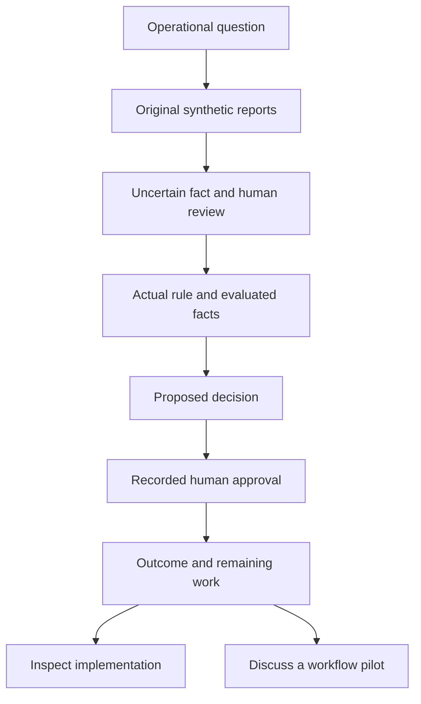
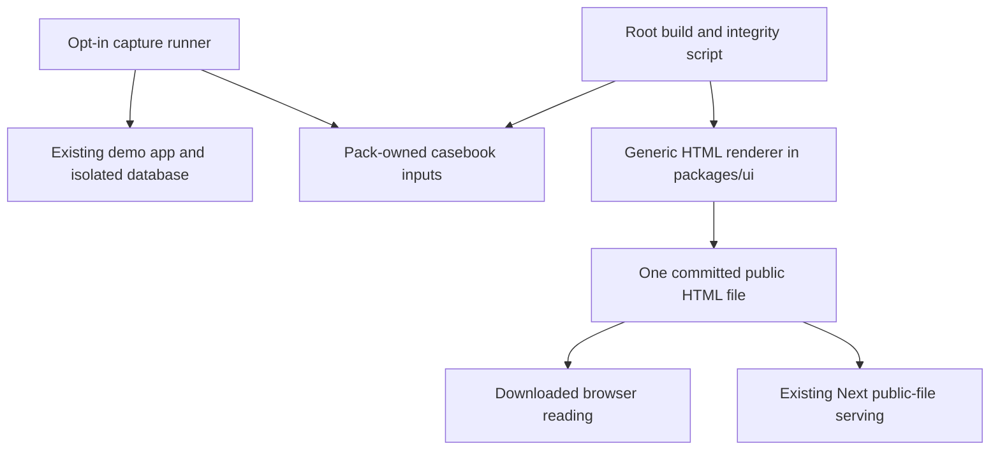
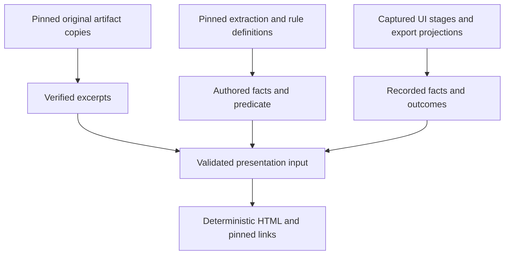
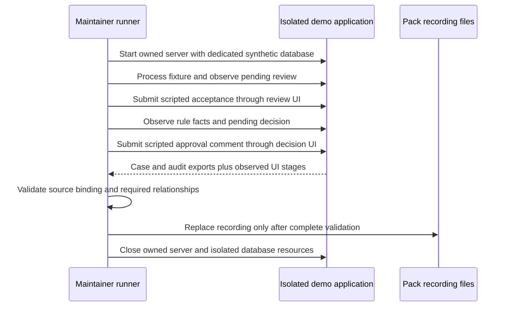

# Public Evidence Casebook - Plan

## Goal Capsule

- **Objective:** A technical evaluator can assess the operational-system engineering demonstrated by Shekib and Kaamchor from one inspectable case before installing the application.
- **Means:** A self-contained recorded evidence casebook, delivered through KTD1.
- **Authority:** `docs/PRD.md`, `docs/PLAN_AMENDMENTS.md`, and the approved ADRs govern product behavior; this contract governs the casebook scope.
- **Execution profile:** One task branch and PR, with dependency-ordered units and the repository completion protocol.
- **Stop conditions:** Surface a conflict with the Product Contract or an unavailable capture prerequisite; do not replace observed evidence with authored expectations.
- **Delivery owner:** The implementing lead verifies and opens the task PR; the owner chooses any later public hosting destination.

---

## Product Contract

### Summary

Create one recorded synthetic case that connects original source passages, uncertain extraction, human review, deterministic rule evaluation, a proposed decision and recorded approval.
Explain the engineering skill demonstrated at each stage and provide direct access to the supporting repository evidence.
Give readers a clear next step to inspect the implementation or discuss a workflow pilot.

### Problem Frame

The owner wants this first public project to demonstrate the capabilities developed by both Shekib and Kaamchor.
No outside reader has tried the repository or demo yet, so audience fit and interest are hypotheses rather than observed demand.
Existing walkthroughs are readable without running the app, but the reader must assemble the compact evidence-to-decision argument from narrative documentation, screenshots and source files.
The full operational demonstration still requires local setup according to current repository documentation.

### Key Decisions

- **Target technical decision makers evaluating a workflow pilot.** Engineering leads, solution architects and technically minded founders can assess implementation judgment as well as commercial applicability; developers exploring the repo are a secondary audience. Governs R2, R8, R12.
- **Use one recorded case rather than expand the live demo.** This limits the first experiment to an inspectable story with existing evidence. Governs R3, R9, R11, R14. (session-settled: user-approved — chosen over a broader operational demonstration: the owner confirmed the single recorded-case scope.)
- **Show evidence and judgment before capabilities claims.** A specific supporting passage or test makes the showcased skill assessable. Governs R4, R5, R6, R7, R8.
- **Reuse the established public brand and contact paths.** The repository calls the consultancy Kaamchor; the owner refers to Kaamchor Solutions, which does not establish a different legal entity or authorize a brand migration. Governs R12.

### Requirements

**Entry and audience**

- R1. A reader can open and read the complete casebook without installing the application, provisioning a database, signing in or supplying model credentials.
- R2. The opening explains the operational question and the engineering capabilities being demonstrated in language a technical evaluator can understand without reading the PRD.
- R3. The first case uses the existing synthetic A-142 repeat-brake story rather than a new scenario or new domain behavior.

**Inspectable argument**

- R4. Readers can inspect the original supporting excerpts and reach the corresponding source artifact for every material factual claim in the case.
- R5. The case shows the uncertain previous-repair reference, its authored 70% confidence, and the human review applied to it without presenting that confidence as a measured live-model result.
- R6. The explanation preserves the actual approval-rule predicate: a safety-critical severity observation and at least two related events within 60 days.
- R7. The outcome distinguishes the proposed decision, recorded human approval and remaining case work without implying physical execution, completed repair or measured savings.
- R8. Each claimed engineering capability is explained through the case and linked to relevant implementation or verification evidence.

**Provenance and presentation**

- R9. The casebook identifies its source revision, pack version and extraction identity so readers can determine which authored example the evidence describes.
- R10. Authored fixture expectations and recorded application outcomes are distinguishable wherever both are shown.
- R11. Synthetic data and deterministic fixture intelligence are disclosed prominently, with no implication of live extraction on unseen inputs or a production client deployment.
- R12. Readers can inspect the GitHub implementation or contact the existing Kaamchor consultancy about adaptation, with attribution to Shekib and the team.
- R13. The complete evidence account remains readable and navigable on mobile and with keyboard or assistive-technology access.
- R14. Reading or exploring the recorded casebook does not approve decisions, change operational state or require an expiring guest workspace.
- R15. Scenario vocabulary and story content remain pack-supplied presentation data rather than new industry-specific behavior in core packages.

### Actors

- A1. A technical evaluator considering Kaamchor for a workflow pilot and seeking evidence of engineering capability.
- A2. A developer following the case to inspect code or tests, with contribution as a possible later outcome.
- A3. The maintainer preparing a versioned recorded example and checking that its public claims match its supporting sources.

### Key Flows

- F1. **Understand and inspect the case.** A1 opens the casebook, reads the operational question, inspects the reports and uncertain observation, follows the review and rule rationale, and reaches the recorded decision outcome. **Covers R1-R7, R9-R11, R13-R14.**
- F2. **Evaluate the engineering.** A1 or A2 follows a capability explanation to the corresponding source or verifying test and can identify the revision and scope of the proof. **Covers R4, R8-R10.**
- F3. **Take a relevant next step.** A1 contacts the consultancy about adaptation or A2 opens the implementation for further inspection. **Covers R12.**

### Acceptance Examples

- AE1. **Covers R1, R11, R14.** A first-time reader opens the recorded case without an app session or local services; the full argument is available and identified as a synthetic fixture demonstration.
- AE2. **Covers R4-R5, R8-R10.** A reader investigates the previous-repair reference and finds the exact supporting passage, the authored confidence, the review behavior and version-specific source or test links.
- AE3. **Covers R6.** A reader checks the repeat-event condition and sees the rule count related events; the explanation does not claim that both counted events must be safety-critical.
- AE4. **Covers R7, R10-R11, R14.** A reader reaches the approved example and can distinguish authorization from physical removal or completed repair; unobserved final action-item states and business benefits are not invented.
- AE5. **Covers R9-R10.** A source revision changes after the example was prepared; the existing case remains visibly tied to its recorded revision rather than silently claiming to describe the newest code.
- AE6. **Covers R12-R13.** A mobile or keyboard reader can inspect the evidence and reach both next-step destinations without completing a live tour.

### Success Criteria

The first reader review should establish whether a technical evaluator can explain which source supports the decision, where human judgment enters, and which code or test supports a demonstrated skill.
Interest in inspecting the implementation or discussing an adaptation is an exploratory outcome, not a promised conversion rate.
There is no baseline and no numerical stars, traffic or inquiry target; initial reader feedback should inform a later expansion decision.

### Scope Boundaries

This work covers one coherent public-facing recorded case, its entry references and its repository or consultancy next steps.
Live public-demo deployment, a new publishing account, automated publishing, additional cases, counterfactual exercises, live-model input, uploads, new contribution systems, a challenge corpus and a proof dashboard are deferred.
New core contracts, migrations, analytics infrastructure, assessment sinks and a consultancy-wide brand migration are not required by this casebook scope.
Public outcome claims remain bounded by R7 and R11; operational certification is outside this scope.

### Dependencies / Assumptions

- The confirmed scope is a product hypothesis because nobody outside the owner has tried the project yet.
- Technical evaluators are the primary audience by delegated targeting judgment; the owner confirmed the resulting scope.
- Existing pack artifacts, the current rule and the tested approval journey supply the case; implementation planning must decide how to obtain and package any actual recorded outcomes.
- Current repository documentation reports live hosting as deferred; external deployment state was not independently verified.
- The existing narrative contains an elapsed-time inconsistency, so the casebook must use the dated source artifacts rather than repeat the unsupported “three days” phrasing.

### Outstanding Questions

**Resolve Before Planning:** None.

**Resolved During Planning:** KTD1, KTD3 and KTD4 define delivery, capture and provenance; U4 defines entry references.
A future public publishing destination requires a separate owner decision; it is not a blocker to building and reviewing the casebook artifact.

### Sources / Research

- `docs/PRD.md` and `docs/PLAN_AMENDMENTS.md`: reference-platform purpose, synthetic data, deterministic intelligence and governance requirements.
- `docs/ideation/2026-10-02-public-website-github-interest-ideation.html`: selected public evidence-casebook direction.
- `docs/walkthroughs/leadership.md`: existing A-142 explanation and its coverage.
- `scenario-packs/asset-reliability/fixtures/demo/artifacts/` (artifacts 001–006): source reports, prior repair, inspection, escalation and unresolved repair work.
- `scenario-packs/asset-reliability/fixtures/demo/extractions/asset-reliability-demo-001.json`: previous-repair reference, confidence and evidence location.
- `scenario-packs/asset-reliability/rules/approval.rules.json`: exact predicate and approval proposal.
- `apps/web/e2e/north-star.spec.ts`: review, rule trace, commented human approval, open case and audit assertions.
- `packages/intelligence/src/fixture-provider.ts`: deterministic checksum lookup and validated output.
- `apps/web/src/lib/firm.ts`: established public consultancy identity and contact destinations.

---

## Planning Contract

**Product Contract preservation:** Product Contract unchanged in scope and stable IDs; its delivery and capture questions are now resolved below.

### Key Technical Decisions

- KTD1. **Deliver one committed, self-contained HTML file.** `apps/web/public/casebook/a-142-repeat-fault.html` is the sole generated reader artifact, usable from disk or as an ordinary public asset. It contains inline CSS and system fonts, with no JavaScript or external assets required for reading. This satisfies R1, R13 and R14 without introducing a second application or converting the dynamic Next app to static export. The same file serves both reading modes, avoiding duplicate renderers. (session-settled: user-approved — chosen over expanding the live demonstration: the owner confirmed a single recorded-case scope.) [Next public-folder documentation](https://nextjs.org/docs/app/api-reference/file-conventions/public-folder) supports the app integration.
- KTD2. **Keep the story in pack data and the renderer generic.** Add a small presentation definition, frozen evidence copies and a recorded projection under `scenario-packs/asset-reliability/casebook/`; a pure TypeScript HTML renderer belongs in `packages/ui`, per amendment A8. A root script assembles these inputs without adding a manifest field or modifying frozen domain contracts. The renderer accepts typed presentation data and contains no pack selection or industry-specific labels, per R3 and R15. Use existing contract validators where full domain objects are available and narrow build-time validation for presentation/export projections; no new dependency is needed.
- KTD3. **Capture the real governed UI journey explicitly.** A dedicated opt-in Playwright capture follows the existing north-star journey and obtains case/audit JSON from the existing authenticated export controls. Store the observed review transition, evaluated rule facts, pending proposal, approval and final case state in a bounded projection. Do not infer missing fields from fixtures. The recording visibly identifies automation exercising human-governed controls, including its synthetic approval comment; it does not claim an actual maintenance lead was consulted. This implements R5-R7 and R10-R11. The capture runner owns an isolated synthetic database and its server, following `packages/test-support/src/lifecycle-pipeline.ts`; it never reuses an arbitrary running server or resets a shared database.
- KTD4. **Bind evidence to a historical revision, not the newest artifact commit.** Capture from a clean, committed application/fixture revision and retain that SHA, pack/provider versions, capture date, capture-harness identity and input checksums. Store original text plus extraction/rule evidence copies so ordinary rendering and checking need neither git history nor network access. Evidence excerpts must match those copies; source/test links use their actual commit SHA. Subsequent repository changes do not invalidate an honestly pinned recording, per R9-R10 and AE5. An intentional refresh obtains a new recording before changing its evidence revision. [GitHub's permalink guidance](https://docs.github.com/en/repositories/working-with-files/using-files/getting-permanent-links-to-files) supports revision-specific links.
- KTD5. **Generate deterministically and fail without replacing a valid artifact.** Render from committed inputs, with dates taken from the recording rather than the current clock. `casebook:build` validates before replacing output; `casebook:check` regenerates in memory and compares bytes without writing or capturing. Checks enforce KTD4 and the required recorded relationships from KTD3. Both the root and filtered web build must check the committed output, covering CI and Docker. A failed capture or invalid input produces a clear nonzero result while preserving the last valid files. This addresses R4, R9-R11 and R14.
- KTD6. **Use semantic HTML and ordinary outbound links.** Keep essential evidence and qualifications visible; native disclosures may hold supporting detail. Use headings, landmarks, a skip link, section anchors, visible focus and wrapping text for R13. Escape source text in its output context and restrict link destinations to expected HTTPS or mailto forms; no arbitrary HTML from pack content. Use the established `FIRM` destinations and attribution for R12. Apply [W3C heading guidance](https://www.w3.org/WAI/tutorials/page-structure/headings/), [HTML disclosure semantics](https://html.spec.whatwg.org/multipage/interactive-elements.html#the-details-element) and [OWASP output-encoding guidance](https://cheatsheetseries.owasp.org/cheatsheets/Cross_Site_Scripting_Prevention_Cheat_Sheet.html).

### High-Level Technical Design

The reader has no runtime connection to the operational application.
The maintainer's capture uses the existing application; the generated artifact uses its committed recording.

**Component boundaries**

**Evidence assembly**

**Capture protocol**

### Evidence Selection

The presentation follows the six existing reports in their stated chronology, with dates rather than the narrative's inconsistent elapsed-time phrase.
Demo-006 is identified as an authored source report, separate from the recorded application's outcome.
The earlier completed maintenance work in demo-002 is not episode closure, per R7.

The recording captures these stages:

| Stage | Observed evidence | Presentation boundary |
|---|---|---|
| Pending review | Field key, displayed confidence, marked passage and pending status | Authored extraction value remains identified under R5 |
| Accepted review | Queue resolution and matching observation-accepted audit data | Scripted interaction under KTD3 |
| Rule evaluation | Rule ID/version, displayed predicate results and actual aggregate value | Exact predicate remains governed by R6 |
| Proposal | Decision type, critical risk, approval policy and pending status | Distinct from authorization under R7 |
| Approval | Matching decision/approval IDs, approved outcome, comment and time | Recorded state under R7 and KTD3 |
| Remaining work | Observed open case and exported action-item states | No inferred repair or physical execution under R7 |

Store only the selected case's records and relevant audit entries, with public reference aliases where needed for relationships.
Exclude workspace/session identifiers, cookies, network headers, connection strings and unrelated records.
Describe this as a selected projection; do not imply that redacted or selected entries independently verify the original audit hash chain.

### Sequencing and Repository Boundaries

Use one task, provisionally OIW-908, after checking that the identifier is unused at execution intake.
The lead creates `docs/tasks/OIW-908.md` from the existing template and registers the work in `SESSION.md` before production edits.
The packet owns the union of the files listed in U1-U4, its agent-run file and the lead's SESSION update; it prohibits contracts, migrations, lockfiles and unrelated operational logic.
Use the repository's branch/worktree convention and one PR, with U1-U4 as dependency-ordered work rather than separate task branches.

U1 commits its capture harness before recording, establishing KTD4's non-circular source identity.
U2 consumes U1's verified inputs; U3 verifies the reader artifact; U4 exposes the checked result through entry points.
Capture uses Postgres only during maintainer preparation, while generation and reading remain independent of it.

### Alternatives and Scope Decisions

A new React casebook route plus an export renderer would create two presentations to maintain, so KTD1 uses one HTML output.
Whole-app static export conflicts with existing cookie-backed workspaces and server actions; no global output-mode change is planned. [Next static-export limitations](https://nextjs.org/docs/app/guides/static-exports).
A committed story containing only expected fixtures would not establish the recorded outcome required by R10, so KTD3 obtains a run.
These choices can be resolved from the existing mechanisms; they do not require developing competing implementations.

Automatic recapture is considered and not built: it would rewrite historical evidence and execute approvals during ordinary builds; explicit capture is adequate.
A runtime evidence API is considered and not built: R1 and R14 are satisfied by embedded evidence, with no service to operate.
A second HTML copy under docs is considered and not built: the public file is already downloadable and independently readable.
Additional analytics and sitemap work are considered and not built: the approved first-reader experiment needs entry links and qualitative feedback, with no verified hosted origin.

### Risks and Deferred Details

Capture infrastructure availability is an execution prerequisite; if local isolated Postgres or the production app cannot run, report the failure rather than substituting expectations.
KTD3 addresses the concrete risk that the existing Playwright configuration can reuse a server whose database is not owned by the capture run.
KTD4 separates fixture dates from capture dates and permits shallow/offline checkouts to render the historical evidence copies.
KTD5 prevents generated HTML from drifting silently from reviewed inputs.

Implementation may adjust helper names and the exact small presentation-data shape without changing the owning requirements or KTDs.
Publication hosting remains the separate owner decision already recorded in the Product Contract.
Broader fixes to existing walkthrough wording and stale project-state history are follow-up work beyond the task's targeted entry references.

### Research Anchors

- `apps/web/e2e/north-star.spec.ts` and `apps/web/e2e/screenshot-regen.spec.ts`: actual UI journey and opt-in capture convention.
- `packages/test-support/src/lifecycle-pipeline.ts`: isolated database lifecycle; its automatic review acceptance is not used as UI-review proof.
- `packages/application/src/exports.ts` and `apps/web/e2e/exports.spec.ts`: existing case/audit projection format and authenticated download controls.
- `apps/web/src/app/w/[workspace]/review/actions.ts` and `apps/web/src/app/w/[workspace]/decisions/actions.ts`: session-scoped review/approval writes and recorded audit transitions.
- `apps/web/playwright.config.ts`: ordinary e2e server behavior, which capture must not reuse blindly.
- `apps/web/AGENTS.md`: installed Next documentation requirement for app edits.
- `Dockerfile`: existing public-asset copy into standalone output; no deployment rewrite is required. [Next standalone-output documentation](https://nextjs.org/docs/app/api-reference/config/next-config-js/output).
- `vitest.config.ts`, `tsconfig.tools.json` and `packages/ui/package.json`: renderer test discovery and script typing boundaries.

---

## Implementation Units

### U1. Capture and author the recorded case

**Goal:** Produce a verifiable pack-owned recording and presentation definition.

**Requirements:** R3-R11, R14-R15; F1-F2; AE2-AE5.

**Dependencies:** Task packet and owned execution environment.

**Files:** Create `scenario-packs/asset-reliability/casebook/case.json`, `scenario-packs/asset-reliability/casebook/sources.json`, `scenario-packs/asset-reliability/casebook/recording.json`, `scripts/casebook/capture.ts`, `apps/web/playwright.casebook-capture.config.ts` and `apps/web/e2e/casebook-capture.spec.ts`. Modify `package.json` for the explicit capture command.

**Approach:**

1. Establish KTD3's owned database/server lifecycle and opt-in capture configuration, using an independent port and no existing-server reuse.
2. Follow the tested journey and collect the stages in Evidence Selection, including pre-approval state and post-approval exports.
3. Validate the exports as their actual projection format rather than pretending they are full domain objects; correlate the approval, decision and audit references before selecting public fields.
4. Freeze original sources, extraction and rule definitions under KTD4; author the story and capability explanations as pack data under KTD2.
5. Save validated outputs through KTD5, with explicit fixture/recording distinctions and limitations per R7 and R10-R11.

**Patterns to follow:** Existing north-star selectors, screenshot-regeneration opt-in behavior, authenticated export controls and isolated database teardown.

**Test scenarios:**

- Covers AE2. Capture observes the authored confidence and supporting passage, then records acceptance and its audit transition.
- Covers AE3. Capture records the actual related-event aggregate value and the matched rule without recasting its predicate.
- Covers AE4. The pending decision requires a comment; a synthetic script comment produces the matching approval, while final case and action-item states come from the exports.
- Missing approval, missing review audit or inconsistent decision references fails capture before replacing a prior valid recording.
- Ordinary e2e invocation skips file-writing capture; the dedicated runner owns and cleans up its database/server on success or failure.
- A dirty application/fixture revision or unowned capture target is rejected before operational mutations.

**Verification:** A reviewer can correlate the recording to the clean source revision and inspect every selected stage, without any inferred outcome or leaked session data.

### U2. Render and check the standalone artifact

**Goal:** Generate the complete evidence argument as one deterministic browser file.

**Requirements:** R1-R4, R8-R15; F1-F2; AE1-AE2, AE5.

**Dependencies:** U1.

**Files:** Create `packages/ui/src/casebook.ts`, `packages/ui/src/casebook.test.ts`, `scripts/casebook/build.ts`, `scripts/casebook/evidence.ts`, `scripts/casebook/evidence.test.ts` and `apps/web/public/casebook/a-142-repeat-fault.html`. Modify `packages/ui/src/index.ts`, `vitest.config.ts`, `package.json` and `apps/web/package.json`.

**Approach:**

1. Implement KTD2's generic presentation surface and KTD6's semantic renderer, with content supplied by the pack inputs.
2. Assemble the frozen source copies, selected excerpts, authored facts and recorded projection according to KTD4; resolve internal evidence references before rendering.
3. Add `casebook:build` and `casebook:check` under KTD5, with an explicit definition-path input and no capture side effects.
4. Wire the check into root and filtered web builds, using source-level tooling that does not depend on an already-built UI package or git history.
5. Include the script test path in root Vitest discovery and retain the existing Docker public-copy behavior.

**Execution note:** Prefer an offline file-opening smoke check early, then strengthen integrity and rendering coverage around the observed result.

**Patterns to follow:** Plain TypeScript tooling, existing stable JSON export behavior, root script typing and the `packages/ui` presentation boundary.

**Test scenarios:**

- Covers AE1. Valid inputs produce all essential stages with embedded styles and no required script or remote resource.
- Covers AE2. Every material claim resolves to a source excerpt or recorded field and a correctly pinned supporting link.
- Covers AE5. A later repository revision does not relabel an older recording; checks use frozen evidence copies, including in a shallow checkout.
- A mismatched excerpt, checksum, recording revision or unresolved evidence reference fails without replacing valid HTML.
- Identical committed inputs produce identical bytes; `casebook:check` leaves files unchanged and detects a deliberately altered generated file.
- Source text containing markup, closing tags or event attributes displays as text; dangerous URL schemes are rejected.
- Filtered web build and root build both detect drift before packaging the checked public file.

**Verification:** The committed HTML matches the reviewed inputs, is independently readable and reaches the existing public-file path without a new application route.

### U3. Verify independent and accessible reading

**Goal:** Prove the reader receives the same complete account in file and app-served modes.

**Requirements:** R1-R2, R4-R14; F1-F3; AE1, AE4-AE6.

**Dependencies:** U2.

**Files:** Create `apps/web/e2e/casebook.spec.ts`, `apps/web/playwright.casebook.config.ts` and focused casebook screenshots under `apps/web/e2e/screenshots/`. Modify `apps/web/package.json` for `test:casebook`.

**Approach:**

1. Use a separate browser-test configuration with no application webServer for direct-file reading.
2. Test KTD1's exact artifact with scripting disabled and resource requests blocked, then test its HTTP public-asset delivery with the existing production server configuration.
3. Check KTD6's navigation, evidence visibility and CTA destinations at desktop and 390px widths, with keyboard interaction and the existing axe tooling.
4. Record screenshots for the visible change and verify that a production GET of the static file succeeds without a database or guest cookie.

**Patterns to follow:** Existing accessibility checks and Playwright screenshots; ordinary e2e uses the existing configuration, independent reading uses the new narrow configuration.

**Test scenarios:**

- Covers AE1. The downloaded file renders the full evidence account with JavaScript disabled, no server and no network requests.
- Covers AE4. Readers can distinguish authored report status, scripted approval and the recorded open case; reading sends no operational mutation.
- Covers AE6. Keyboard-only navigation reaches the original evidence and both next-step links, with visible focus and no page overflow at 390px.
- Supporting disclosures work by keyboard while essential qualifications stay visible; the HTML has meaningful headings and no serious or critical axe findings.
- The served HTML URL returns the committed document and does not issue a workspace cookie or require a functioning database.
- Outgoing links use valid absolute destinations; offline readers still see a readable contact address and embedded source support.

**Verification:** Direct-file checks and production delivery checks pass, with reviewed screenshots demonstrating readable mobile evidence.

### U4. Add entry points and maintainer guidance

**Goal:** Make the case discoverable and maintainable without implying a hosted service exists.

**Requirements:** R1-R2, R8-R12, R14-R15; F1-F3; AE1, AE5-AE6.

**Dependencies:** U2-U3.

**Files:** Modify `apps/web/src/app/page.tsx`, `apps/web/tests/routes.smoke.test.tsx` and `README.md`. Create `scenario-packs/asset-reliability/casebook/README.md`; update `docs/tasks/OIW-908.md`, `docs/agent-runs/OIW-908.md` and the lead-owned `SESSION.md`.

**Approach:**

1. Add a generic landing-page link to the HTML asset using an ordinary anchor, with no scenario-specific story embedded in the component.
2. Add a README download/file entry that explains saving and opening the artifact in a browser; do not advertise GitHub's file-source view as a rendered website.
3. Document generation, integrity checking and intentional capture refresh using KTD3-KTD5; distinguish recording source revision from the artifact's later publication commit.
4. Reuse KTD6's brand destinations and keep any existing interactive-demo setup references separate from the artifact reading instructions.
5. Complete the task handoff and PR documentation through the repository's templates.

**Patterns to follow:** Existing marketing page composition, `FIRM` identity/contact data and repository task/PR templates.

**Test scenarios:**

- Covers F1 / AE1. The landing-page link targets the actual static file, and the README download instructions require no application installation.
- Covers F3 / AE6. The generated artifact exposes the established GitHub and consultancy destinations with Shekib/team attribution.
- Refresh instructions preserve AE5's historical pinning and explicitly separate capture from routine generation/checking.

**Verification:** A cold reader can discover and open the case, and a maintainer can understand how to update it without hidden session knowledge.

---

## Verification Contract

These are implementation gates, not tests executed while writing this plan.
Existing commands were verified in the manifests; the casebook commands below are planned additions.

| Gate | Applies to | Passing evidence |
|---|---|---|
| `pnpm lint` | U1-U4 | Changed code follows repository rules |
| `pnpm typecheck` | U1-U4 | Renderer, scripts and capture configuration type-check |
| `pnpm test` | U1-U4 | Existing suites and new discovered renderer/evidence/entry tests pass |
| `pnpm eval` | U1-U2 | Existing deterministic evaluation behavior remains intact |
| `pnpm validate:packs` | U1-U2 | Added pack-side presentation files do not alter manifest validity |
| `pnpm architecture:check` | U1-U4 | Neutrality, boundary and credential checks pass |
| `pnpm casebook:check` | U2-U4 | Committed output matches its pinned inputs without writes |
| `pnpm build` and `pnpm --filter @oiw/web build` | U2-U4 | Root and Docker-style filtered builds include the checked file |
| `pnpm --filter @oiw/web test:casebook` | U3 | Direct-file reading passes without app services or network |
| `pnpm --filter @oiw/web test:e2e` | U1, U3-U4 | Public-file delivery and the existing governed journey remain valid |

The opt-in `pnpm casebook:capture` produces the reviewed U1 recording against its owned synthetic environment; it is not part of a normal build or CI refresh.
The capture's assertions must pass before its output is used.
Use a production static-file GET with unavailable database access to substantiate R1's runtime boundary; this is additional evidence beyond the ordinary DB-backed e2e environment.

`release:validate` is absent and no skill-behavior evaluation is applicable to this presentation feature.
Record unavailable commands or failed prerequisites in the agent-run file rather than skipping silently.
Existing CI quality/e2e checks remain required by the repository completion protocol.

---

## Definition of Done

- U1 supplies a validated, source-bound recording covering the selected stages, with the distinctions required by R5-R7 and R10-R11.
- U2 produces the single checked artifact under KTD1 and passes integrity, escaping and deterministic-generation tests.
- U3 proves independent, mobile and keyboard reading, plus production public-file delivery without runtime database/session dependence.
- U4 exposes working entry references and documents intentional refresh, with no fabricated hosted destination.
- All requirements and AE1-AE6 are covered by the implementation and Verification Contract, and abandoned experimental code is removed.
- The assigned task packet, agent-run and required documentation are complete; no critical TODO remains.
- Work is committed on the task branch and an OIW-908 PR is opened or updated using the repository template, with screenshots, limitations and neutrality evidence.
- Required local gates pass and CI quality/e2e checks are green; publishing and merging follow the owner's authorization and repository rules.
