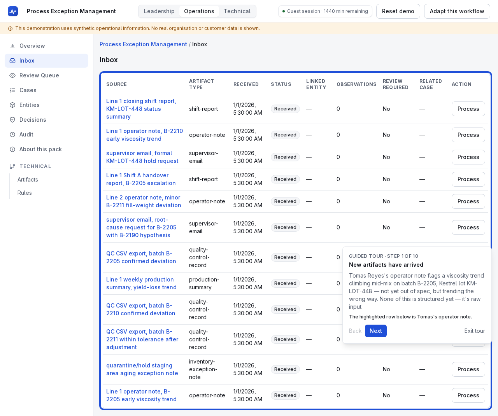
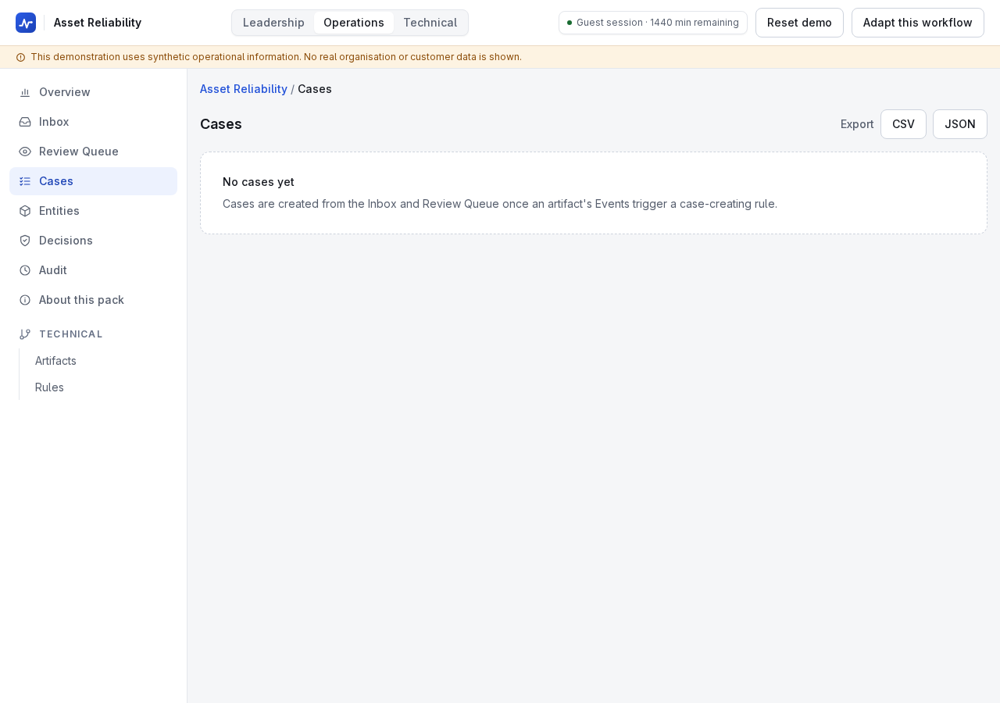
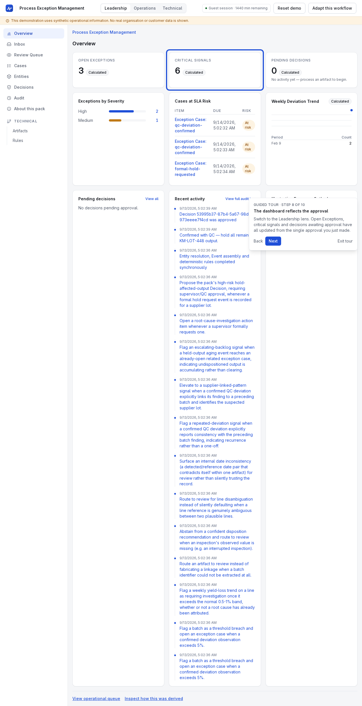

# How an exception moves from source report to assigned action

An operations-audience walkthrough grounded in the Process Exceptions
pack's KM-LOT-448 storyline — the supplier-lot escalation walked step by
step in `docs/DEMO_SCRIPT.md`'s "Full Guided Demonstration — Process
Exception Management" and enforced in CI by
`apps/web/e2e/process-exceptions-tour.spec.ts`.

## Source

Tomas Reyes's operator note flags a viscosity trend climbing mid-mix on
batch B-2205, supplier lot KM-LOT-448 — not yet out of spec, but trending
the wrong way. It arrives in the inbox as raw text, alongside a QC
confirmation record, an escalation email, and half a dozen other artifacts
that, read individually, don't yet show a pattern.

## Review

QC's confirmation record for B-2205 reports an 8.2% viscosity deviation and
4,200 units affected — but the reported cause is explicitly "under
investigation." Rather than guessing a root cause, the platform routes that
field to a human reviewer, who sees the original text, the extracted value
and the evidence span before accepting it.

## Case

Priya's escalation — citing two consecutive deviations on KM-LOT-448 and a
mounting quarantine backlog — makes a deterministic rule's condition true. A
Case is created automatically, linking the KM-LOT-448 pattern across both
batches, the backlog, and every piece of supporting evidence gathered so
far.

## Owner

The Case carries an owner, a priority and a due date the moment it's
created — set by the pack's Case definition (`workflowId`, default
priority/severity, relative due time), not left for someone to fill in
later (ADR-011).

## SLA

The Operations lens surfaces due dates and pending work directly, so an
approaching or missed SLA is visible without anyone having to go looking for
it — the SLA-table and pending-approvals widgets exist specifically for
this (`docs/UX_SPEC.md` §6.5–§6.6).

## Approval

The rule's output is a proposed Hold Affected Output decision — high-risk,
because it stops shipment of potentially affected product — and it does not
execute until a supervisor/QC approver explicitly approves it, with a
required comment.

## Closure

The Case cannot close until its pack-defined closure requirements are
satisfied — a recorded disposition and investigation evidence — enforced by
the workflow layer, not by convention (PRD FR-072). A closure attempted
before those requirements are met is rejected, the same way an approval
attempted without a recorded Approval is rejected (ADR-005, ADR-011).

## What this looks like from the leadership lens

Once the hold decision is approved, the same underlying state is visible
from a different angle:

This is the same pack-neutral mechanism the Asset Reliability walkthrough
uses for a different vocabulary — "exception" and "batch" here,
"case" and "asset" there — proving the same core engine, not two
implementations (PRD §10, ADR-002).
